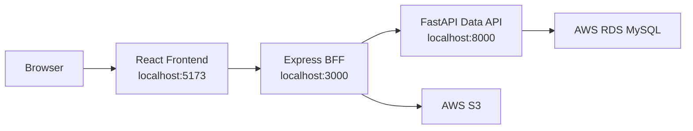

# Routine Mate

## 목차

- [프로젝트 개요](#프로젝트-개요)
- [주요 기능](#주요-기능)
- [기술 스택](#기술-스택)
- [아키텍처](#아키텍처)
- [프로젝트 구조](#프로젝트-구조)
- [실행 방법](#실행-방법)
- [환경 변수](#환경-변수)
- [데이터베이스](#데이터베이스)
- [API 요약](#api-요약)
- [보안과 운영 설계](#보안과-운영-설계)
- [개발과 검증](#개발과-검증)
- [관련 문서](#관련-문서)
- [팀원](#팀원)

Routine Mate는 개인 루틴을 등록하고, 완료 기록을 남기며, 인증 피드와 챌린지로 습관 형성을 이어가는 루틴 관리 SNS 웹 서비스입니다.

사용자는 아침, 점심, 저녁 시간대별 루틴을 만들고 매일 완료 여부를 기록할 수 있습니다. 자세한 인증이 필요한 루틴은 글과 이미지를 함께 올려 피드로 공유할 수 있고, 다른 사용자의 인증 피드에 댓글과 좋아요를 남길 수 있습니다. 관리자는 공지사항을 작성하고, 신고된 피드를 처리하며, 챌린지를 등록하고 참여 현황을 확인할 수 있습니다.

이 저장소는 React 프론트엔드, Express BFF 백엔드, FastAPI 데이터 API, MySQL 데이터베이스 연동 코드를 포함합니다. 실제 DB와 파일 저장소는 외부 AWS RDS MySQL, AWS S3를 사용하도록 설계되어 있습니다.

개발 과정의 날짜별 기록은 루트 README에서 분리했습니다. 과거 개발일지와 트러블슈팅 내역은 [docs/개발일지.md](docs/%EA%B0%9C%EB%B0%9C%EC%9D%BC%EC%A7%80.md)에서 확인할 수 있습니다.

## 프로젝트 개요

Routine Mate는 단순 체크리스트가 아니라 루틴을 지속하도록 돕는 웹 애플리케이션을 목표로 합니다. 사용자는 매일 반복할 일을 시간대별로 나누어 관리하고, 루틴 완료 기록을 쌓으며, 필요하면 사진이나 영상 인증을 피드에 공유할 수 있습니다.

프로젝트는 다음 문제를 해결하는 방향으로 설계되었습니다.

1. 루틴을 등록했지만 실제 완료 기록이 남지 않는 문제
2. 혼자 체크만 하다 보니 지속 동기가 떨어지는 문제
3. 루틴 인증 사진이 로컬 PC에만 저장되어 팀원이나 다른 사용자 화면에서 깨지는 문제
4. 관리자 공지, 신고 처리, 챌린지 운영이 프론트 mock 데이터에 머무르는 문제
5. 프론트엔드, 인증, 파일 업로드, DB 로직이 한 계층에 섞이면 유지보수가 어려운 문제

이를 위해 프론트엔드와 공개 API, 내부 DB API를 분리했습니다. React는 화면과 사용자 인터랙션을 담당하고, Express는 세션, CORS, 파일 업로드, 공개 API를 담당합니다. FastAPI는 MySQL에 직접 접근하는 데이터 계층으로 두어 도메인 CRUD와 트랜잭션 처리를 맡습니다.

## 주요 기능

### 사용자 기능

| 기능 | 설명 |
| --- | --- |
| 회원가입 | 아이디, 비밀번호, 닉네임, 생년월일, 성별, 이메일을 입력해 계정을 생성합니다. 비밀번호는 Express에서 bcrypt 해시로 변환한 뒤 DB에 저장합니다. |
| 로그인/로그아웃 | 로그인 성공 시 세션 ID를 DB `sessions` 테이블에 저장하고, 브라우저에는 httpOnly 쿠키로 전달합니다. 로그아웃 시 세션 DB와 쿠키를 함께 정리합니다. |
| 세션 복구 | 새로고침 후에도 `/me` 요청으로 현재 로그인 사용자를 복구합니다. |
| 아이디 중복 확인 | 회원가입 화면에서 login_id와 nickname 중복 여부를 실제 DB 기준으로 확인합니다. |
| 아이디 찾기 | 닉네임과 이메일 조합으로 login_id를 조회합니다. |
| 임시 비밀번호 발급 | 닉네임, 아이디, 이메일 조합이 일치하면 임시 비밀번호를 발급하고 bcrypt 해시로 저장합니다. |
| 프로필 수정 | 닉네임, 자기소개, 프로필 이미지를 수정할 수 있습니다. 프로필 이미지는 S3 URL로 저장됩니다. |
| 루틴 등록 | 제목, 카테고리, 목표 시간, 시간대, 완료 방식, 반복 주기, 설명을 입력해 루틴을 생성합니다. |
| 루틴 목록 조회 | 로그인한 사용자의 활성 루틴을 최신순으로 조회합니다. 삭제된 루틴은 soft delete로 숨깁니다. |
| 루틴 삭제 | 루틴을 실제 삭제하지 않고 `deleted_at`을 채워 화면에서 제외합니다. 기존 완료 기록과 피드 연결은 보존합니다. |
| 루틴 완료 체크 | 하루 루틴 완료 기록을 `routine_completions`에 저장합니다. 오늘 완료한 루틴과 전체 완료 이력을 조회할 수 있습니다. |
| 피드 작성 | 루틴 인증 글과 이미지/영상을 업로드합니다. 파일은 S3에 저장하고 DB에는 URL과 메타데이터를 저장합니다. |
| 피드 목록 | 전체 피드를 커서 기반 페이지네이션으로 조회합니다. 일반 피드와 피드 공유된 챌린지 인증을 함께 표시합니다. |
| 피드 삭제 | 본인 피드만 삭제할 수 있습니다. DB soft delete 성공 후 S3 객체 삭제를 시도합니다. |
| 댓글 | 피드에 댓글을 작성하고, 피드별 댓글 목록을 조회하며, 본인 댓글을 삭제할 수 있습니다. |
| 좋아요 | 피드 좋아요를 토글합니다. `feed_likes`의 `(feed_id, user_id)` 유니크 제약으로 중복 좋아요를 방지합니다. |
| 마이페이지 | 사용자 프로필, 루틴 수, 완료 기록, 연속 달성, 최근 인증 갤러리를 한 번에 조회합니다. |
| 통계 | 기간별 루틴 달성률, 완료 일자, 누적 인증 수를 조회합니다. |
| 챌린지 목록 | 관리자가 등록한 활성 챌린지를 조회합니다. |
| 챌린지 참여 | 원하는 챌린지에 참여하고 내 챌린지 목록에서 진행 상태를 확인합니다. |
| 챌린지 인증 | 참여 중인 챌린지에 하루 1회 인증을 등록합니다. 인증 글, 첨부 파일, 피드 공유 여부를 저장합니다. |

### 관리자 기능

| 기능 | 설명 |
| --- | --- |
| 관리자 접근 제어 | 현재 구현은 `login_id === "admin"`을 기준으로 관리자 권한을 판별합니다. |
| 공지 작성 | 관리자는 카테고리, 제목, 본문, 게시일을 입력해 공지사항을 등록할 수 있습니다. |
| 공지 수정/삭제 | 등록된 공지사항을 수정하거나 soft delete로 숨길 수 있습니다. |
| 신고 목록 조회 | 신고된 피드를 상태별로 확인합니다. |
| 신고 상세 조회 | 신고 대상 피드, 신고자, 대상 사용자, 신고 사유, 처리 상태를 확인합니다. |
| 신고 처리 | 한 피드에 대해 접수된 pending 신고를 관리자 코멘트와 함께 completed 상태로 처리합니다. |
| 챌린지 등록 | 제목, 설명, 카테고리, 시작일, 종료일을 입력해 챌린지를 생성합니다. 총 진행 일수는 서버에서 계산합니다. |
| 챌린지 수정/삭제 | 챌린지 정보를 수정하거나 soft delete 처리합니다. |
| 참여자 현황 | 특정 챌린지의 참여자, 상태, 참여일, 인증 일수를 조회합니다. |
| 인증 현황 | 챌린지별 전체 인증 내역과 첨부 파일 정보를 확인합니다. |

## 기술 스택

### Frontend

| 항목 | 기술 |
| --- | --- |
| UI 라이브러리 | React 19 |
| 빌드 도구 | Vite 8 |
| 라우팅 | React Router DOM 7 |
| PWA | vite-plugin-pwa |
| 스타일 | CSS |
| 패키지 매니저 | npm |

### Express Backend

| 항목 | 기술 |
| --- | --- |
| 런타임 | Node.js 20 이상, 23 미만 |
| 서버 | Express 5 |
| 인증 보조 | cookie-parser |
| CORS | cors |
| 비밀번호 해시 | bcryptjs |
| 파일 업로드 | multer, multer-s3 |
| S3 연동 | AWS SDK for JavaScript v3 |
| 내부 API 호출 | node-fetch |
| 세션 ID | uuid |

### FastAPI Backend

| 항목 | 기술 |
| --- | --- |
| 언어 | Python |
| API 프레임워크 | FastAPI |
| ASGI 서버 | Uvicorn |
| 데이터 검증 | Pydantic |
| DB 드라이버 | PyMySQL |
| 환경 변수 | python-dotenv |
| UUID | uuid7, uuid6 |
| 비밀번호 해시 검증 보조 | bcrypt |

### Database and Infrastructure

| 항목 | 기술 |
| --- | --- |
| 데이터베이스 | MySQL 8, AWS RDS |
| 파일 저장소 | AWS S3 |
| 컨테이너 | Docker, Docker Compose |
| 외부 공개/터널 문서 | cloudflared 관련 문서 포함 |

## 아키텍처

이 프로젝트는 3계층 구조를 사용합니다.



### 계층별 책임

| 계층 | 책임 |
| --- | --- |
| React | 화면 렌더링, 라우팅, 사용자 입력 처리, API 요청 |
| Express | 공개 API, 세션 쿠키, CORS, 로그인/회원가입, 파일 업로드, 관리자 가드, FastAPI 호출 |
| FastAPI | MySQL CRUD, 트랜잭션 처리, 커넥션 풀, DB 조회 최적화 |
| MySQL | 사용자, 루틴, 완료 기록, 피드, 챌린지, 공지, 신고 데이터 저장 |
| S3 | 피드 이미지/영상, 프로필 이미지, 챌린지 인증 첨부 파일 저장 |

### 왜 Express와 FastAPI를 분리했나

Express는 브라우저와 직접 맞닿는 계층입니다. 세션 쿠키, CORS, 파일 업로드, 관리자 권한 검사를 담당하기에 적합합니다. 특히 `multer-s3`를 활용해 브라우저에서 올라온 파일을 S3로 바로 저장하고, 실패 시 보상 삭제를 처리합니다.

FastAPI는 DB와 직접 맞닿는 내부 API입니다. 각 라우터는 MySQL 커넥션을 빌려 도메인별 CRUD를 수행하고, 성공 시 commit, 실패 시 rollback합니다. 외부 사용자가 FastAPI를 직접 호출하지 못하도록 `INTERNAL_API_KEY`를 Express와 FastAPI 양쪽에 동일하게 설정합니다.

## 프로젝트 구조

```text
.
├── src
│   ├── frontend              # React 화면과 라우팅
│   │   ├── App.jsx
│   │   ├── HomePage.jsx
│   │   ├── RoutinePage.jsx
│   │   ├── FeedPage.jsx
│   │   ├── ChallengePage.jsx
│   │   ├── MyPage.jsx
│   │   ├── AdminPage.jsx
│   │   ├── LoginPage.jsx
│   │   ├── SignupPage.jsx
│   │   ├── NoticeList.jsx
│   │   ├── NoticeDetail.jsx
│   │   └── config.js
│   ├── backend               # Express BFF
│   │   ├── app.js
│   │   ├── database.js
│   │   ├── routes
│   │   ├── middleware
│   │   └── lib
│   ├── python_api            # FastAPI DB API
│   │   ├── app.py
│   │   ├── database.py
│   │   └── routers
│   └── css
├── docs                      # 문서, 마이그레이션, 개발일지, 시드 SQL
├── public                    # 정적 파일과 PWA 아이콘
├── docker-compose.yml        # 개발용 Docker Compose
├── docker-compose.prod.yml   # self-contained 이미지 검증용 Compose
├── Dockerfile.frontend
├── Dockerfile.backend
├── Dockerfile.python_api
├── start.sh                  # 로컬 직접 실행
├── start-docker.sh           # Docker 실행 보조 스크립트
├── package.json              # 프론트엔드 패키지
└── vite.config.js
```

라우터의 상세 책임은 다음과 같습니다.

| 위치 | 역할 |
| --- | --- |
| `src/backend/routes/login.js` | 회원가입, 로그인, 로그아웃, 세션 복구, 프로필 수정, 아이디/비밀번호 찾기 |
| `src/backend/routes/routine.js` | 루틴 생성, 조회, 삭제 요청을 FastAPI로 중계 |
| `src/backend/routes/completion.js` | 루틴 완료 기록 생성, 조회, 삭제 중계 |
| `src/backend/routes/feed.js` | 피드 생성, 목록 조회, 삭제, S3 업로드/삭제 처리 |
| `src/backend/routes/comment.js` | 댓글 작성, 조회, 삭제 |
| `src/backend/routes/like.js` | 좋아요 토글 |
| `src/backend/routes/mypage.js` | 마이페이지 통합 정보 조회 |
| `src/backend/routes/stats.js` | 통계 조회와 짧은 캐시 |
| `src/backend/routes/notice.js` | 공지사항 CRUD 중계 |
| `src/backend/routes/report.js` | 신고 접수, 조회, 처리 중계 |
| `src/backend/routes/challenge.js` | 챌린지 목록, 참여, 인증, 관리자 CRUD 중계 |
| `src/python_api/routers/*` | 실제 MySQL CRUD와 트랜잭션 처리 |

## 실행 방법

### 사전 준비

필수 준비물은 다음과 같습니다.

| 항목 | 설명 |
| --- | --- |
| Docker Desktop | 팀원 공유 실행과 데모 검증에는 Docker 실행을 권장합니다. |
| Node.js | 호스트 직접 실행 시 필요합니다. `package.json` 기준 Node.js 20 이상, 23 미만을 권장합니다. |
| npm | `package.json` 기준 npm 10 이상을 권장합니다. |
| Python | 호스트 직접 실행 시 FastAPI 가상환경 생성에 필요합니다. |
| AWS RDS 접속 정보 | `src/python_api/.env`에 입력합니다. |
| AWS S3 접속 정보 | `src/backend/.env`에 입력합니다. |

`.env` 파일은 저장소에 커밋하지 않습니다. 처음 실행할 때는 예시 파일을 복사한 뒤 값을 채웁니다.

```bash
cp .env.example .env
cp src/backend/.env.example src/backend/.env
cp src/python_api/.env.example src/python_api/.env
```

### Docker로 실행

팀원 공통 실행, 데모 전 검증, 로컬 환경 차이를 줄이는 목적이라면 Docker 실행을 권장합니다.

```bash
docker compose up --build
```

또는 보조 스크립트를 사용할 수 있습니다.

```bash
./start-docker.sh
```

실행 후 접속 주소는 다음과 같습니다.

| 서비스 | 주소 | 설명 |
| --- | --- | --- |
| Frontend | `http://localhost:5173` | 브라우저에서 접속하는 메인 화면 |
| Express | `http://localhost:3000` | React가 호출하는 공개 API |
| FastAPI | `http://localhost:8000` | Express가 호출하는 내부 데이터 API |

Docker Compose에서는 컨테이너 간 통신을 위해 Express의 `PYTHON_API`가 `http://python_api:8000`으로 덮어써집니다. 브라우저에서 접근하는 주소는 여전히 `http://localhost:5173`, `http://localhost:3000`입니다.

컨테이너를 백그라운드로 실행하려면 다음 명령을 사용합니다.

```bash
docker compose up -d --build
```

로그 확인:

```bash
docker compose logs -f
```

중지:

```bash
docker compose down
```

의존성이나 Dockerfile 변경 뒤 문제가 계속되면 볼륨까지 제거하고 다시 빌드할 수 있습니다.

```bash
docker compose down -v
docker compose up --build
```

### 호스트에서 직접 실행

Docker를 쓰지 않고 로컬에서 세 서버를 직접 띄울 수도 있습니다.

```bash
./start.sh
```

`start.sh`는 다음 작업을 수행합니다.

1. `src/python_api/venv`가 없으면 Python 가상환경을 만들고 `requirements.txt`를 설치합니다.
2. `src/backend/node_modules`가 없으면 Express 의존성을 설치합니다.
3. 루트 `node_modules`가 없으면 프론트엔드 의존성을 설치합니다.
4. FastAPI를 `uvicorn --reload`로 실행합니다.
5. Express를 `node --watch`로 실행합니다.
6. React를 Vite dev server로 실행합니다.

수동으로 각각 실행하려면 아래 순서로 실행합니다.

```bash
# 1. Frontend
npm install
npm run dev
```

```bash
# 2. Express Backend
cd src/backend
npm install
npm run dev
```

```bash
# 3. FastAPI
cd src/python_api
python3 -m venv venv
source venv/bin/activate
pip install -r requirements.txt
uvicorn app:app --reload --port 8000
```

프론트엔드는 기본적으로 `VITE_EXPRESS_URL`을 사용합니다. 값이 없으면 `http://localhost:3000`을 기본값으로 사용합니다.

### 빌드와 정적 미리보기

프론트엔드 빌드:

```bash
npm run build
```

프론트엔드 preview:

```bash
npm run preview
```

터널이나 외부 공개 환경에서는 Vite dev server보다 빌드 결과물을 preview로 띄우는 방식이 안정적입니다.

```bash
./start.sh prod
```

## 환경 변수

환경변수는 세 위치에 나뉩니다.

### 루트 `.env`

React/Vite에서 사용하는 값입니다. `VITE_` 접두사가 붙은 변수만 브라우저 번들에 노출됩니다.

| 변수 | 예시 | 설명 |
| --- | --- | --- |
| `VITE_EXPRESS_URL` | `http://localhost:3000` | React가 호출할 Express 서버 주소 |

### `src/backend/.env`

Express가 사용하는 값입니다.

| 변수 | 예시 | 설명 |
| --- | --- | --- |
| `PORT` | `3000` | Express 서버 포트 |
| `PYTHON_API` | `http://localhost:8000` | FastAPI 서버 주소. Docker에서는 Compose가 `http://python_api:8000`으로 덮어씁니다. |
| `INTERNAL_API_KEY` | `replace-with-a-long-random-shared-secret` | Express가 FastAPI 호출 시 붙이는 내부 인증 키 |
| `FRONTEND_URL` | `http://localhost:5173` | CORS 허용 프론트엔드 origin. 콤마로 여러 개 지정할 수 있습니다. |
| `NODE_ENV` | `development` | 운영 배포에서는 `production` 권장. 쿠키 secure/sameSite 정책에 영향을 줍니다. |
| `SLOW_REQUEST_MS` | `500` | 이 시간 이상 걸린 Express 요청을 로그로 남깁니다. |
| `STATS_CACHE_TTL_MS` | `60000` | 통계 API 캐시 유지 시간입니다. |
| `AWS_REGION` | `ap-northeast-2` | S3 리전 |
| `AWS_S3_BUCKET` | `your-bucket-name` | 피드/프로필/챌린지 파일 저장 버킷 |
| `AWS_ACCESS_KEY_ID` | `your-access-key-id` | S3 업로드용 IAM access key |
| `AWS_SECRET_ACCESS_KEY` | `your-secret-access-key` | S3 업로드용 IAM secret key |

### `src/python_api/.env`

FastAPI가 사용하는 값입니다.

| 변수 | 예시 | 설명 |
| --- | --- | --- |
| `DB_HOST` | `your-rds-endpoint.ap-northeast-2.rds.amazonaws.com` | MySQL/RDS 호스트 |
| `DB_USER` | `your-db-user` | DB 사용자 |
| `DB_PASSWORD` | `your-db-password` | DB 비밀번호 |
| `DB_NAME` | `capston` | DB 이름 |
| `DB_PORT` | `3306` 또는 팀 DB 포트 | DB 포트 |
| `INTERNAL_API_KEY` | `replace-with-a-long-random-shared-secret` | Express와 동일해야 하는 내부 인증 키 |
| `DB_POOL_SIZE` | `8` | 기본 커넥션 풀 크기 |
| `DB_POOL_MAX_OVERFLOW` | `4` | 기본 풀을 초과해 임시 생성 가능한 연결 수 |
| `SLOW_QUERY_MS` | `200` | 이 시간 이상 걸린 SQL을 로그로 남깁니다. |
| `SLOW_REQUEST_MS` | `500` | 이 시간 이상 걸린 FastAPI 요청을 로그로 남깁니다. |

`INTERNAL_API_KEY`는 `src/backend/.env`와 `src/python_api/.env`에서 반드시 같은 값이어야 합니다. 서로 다르면 Express가 FastAPI를 호출할 때 내부 인증에서 실패합니다.

## 데이터베이스

데이터베이스는 MySQL 8 기준으로 설계했습니다. 주요 PK는 `CHAR(36)` UUID 계열 문자열을 사용하며, 주요 도메인 테이블은 `deleted_at` 컬럼을 둔 soft delete 정책을 따릅니다.

### 주요 테이블

| 도메인 | 테이블 | 설명 |
| --- | --- | --- |
| 계정/세션 | `users` | 로그인 아이디, 비밀번호 해시, 닉네임, 이메일, 성별, 생년월일, 프로필 이미지, 자기소개 저장 |
| 계정/세션 | `sessions` | 로그인 세션 ID, 사용자 ID, 만료 시간 저장 |
| 루틴 | `routines` | 사용자별 루틴 제목, 카테고리, 시간대, 완료 방식, 목표, 반복 주기, 설명 저장 |
| 루틴 | `routine_completions` | 루틴 완료 기록, 인증 문구, 완료 시각 저장 |
| 피드 | `feeds` | 루틴 인증 피드 본문, 작성자, 연결 루틴/완료 기록 저장 |
| 피드 | `feed_images` | 피드 첨부 파일 URL과 파일 타입 저장 |
| 피드 | `feed_comments` | 피드 댓글 저장 |
| 피드 | `feed_likes` | 피드 좋아요 저장. `(feed_id, user_id)` 유니크 제약으로 중복 방지 |
| 챌린지 | `challenges` | 챌린지 제목, 설명, 카테고리, 기간, 총 일수, 참여자 수 저장 |
| 챌린지 | `challenge_participants` | 사용자와 챌린지 참여 관계 저장 |
| 챌린지 | `challenge_proofs` | 챌린지 인증 본문, 인증일, 피드 공유 여부 저장 |
| 챌린지 | `challenge_proof_files` | 챌린지 인증 첨부 파일 저장 |
| 운영 | `notices` | 관리자 공지사항 저장 |
| 운영 | `reports` | 피드 신고, 신고자, 대상자, 처리 상태, 관리자 코멘트 저장 |

### 삭제 정책

주요 도메인 테이블은 hard delete 대신 soft delete를 사용합니다.

| 테이블 | 삭제 방식 |
| --- | --- |
| `users` | `deleted_at` 사용 |
| `routines` | `deleted_at` 사용 |
| `routine_completions` | `deleted_at` 사용 |
| `feeds` | `deleted_at` 사용 |
| `challenges` | `deleted_at` 사용 |
| `challenge_proofs` | `deleted_at` 사용 |
| `notices` | `deleted_at` 사용 |
| `reports` | `deleted_at` 사용 |
| `feed_comments` | hard delete |
| `feed_likes` | hard delete |

soft delete를 사용하는 이유는 삭제된 루틴이나 피드와 연결된 완료 기록, 신고 기록, 통계 데이터를 갑자기 잃지 않기 위해서입니다. 화면에서 조회할 때는 `deleted_at IS NULL` 조건으로 활성 데이터만 보여줍니다.

### 마이그레이션과 시드 데이터

관련 SQL 파일은 `docs` 폴더에 있습니다.

| 파일 | 설명 |
| --- | --- |
| [docs/migrations-2026-05-13-admin-challenge.sql](docs/migrations-2026-05-13-admin-challenge.sql) | 챌린지, 공지, 신고 테이블 생성 |
| [docs/migrations-2026-05-17-feeds-soft-delete.sql](docs/migrations-2026-05-17-feeds-soft-delete.sql) | 피드 soft delete 컬럼 추가 |
| [docs/migrations-2026-05-20-challenge-feed-share.sql](docs/migrations-2026-05-20-challenge-feed-share.sql) | 챌린지 인증 피드 공유 컬럼/인덱스 추가 |
| [docs/migrations-2026-05-20-users-bio.sql](docs/migrations-2026-05-20-users-bio.sql) | 사용자 자기소개 컬럼 추가 |
| [docs/performance-indexes-2026-05-10.sql](docs/performance-indexes-2026-05-10.sql) | 조회 성능 개선 인덱스 |
| [docs/seed-realistic-data-2026-06-02.sql](docs/seed-realistic-data-2026-06-02.sql) | 사용자 10명, 루틴 40개, 챌린지 10개, 공지 20개 데모 데이터 |

ERD와 더 자세한 테이블 설명은 [docs/report/03-database.md](docs/report/03-database.md)와 [docs/report/deliverable/routine_mate.dbml](docs/report/deliverable/routine_mate.dbml)을 참고하세요.

## API 요약

React는 Express API만 호출합니다. FastAPI는 Express 뒤에 있는 내부 데이터 API이며, 브라우저가 직접 호출하는 것을 전제로 하지 않습니다.

### Express API

| 메서드 | 경로 | 설명 | 인증 |
| --- | --- | --- | --- |
| `POST` | `/signup` | 회원가입 | 없음 |
| `POST` | `/login` | 로그인, 세션 쿠키 발급 | 없음 |
| `POST` | `/logout` | 로그아웃, 세션 삭제 | 세션 있으면 처리 |
| `GET` | `/me` | 현재 로그인 사용자 조회 | 필요 |
| `PATCH` | `/me/profile` | 닉네임, 자기소개, 프로필 이미지 수정 | 필요 |
| `POST` | `/find-id` | 아이디 찾기 | 없음 |
| `POST` | `/find-password` | 임시 비밀번호 발급 | 없음 |
| `GET` | `/check-duplicate` | 아이디/닉네임 중복 확인 | 없음 |
| `GET` | `/routine` | 내 루틴 목록 조회 | 필요 |
| `POST` | `/routine` | 루틴 생성 | 필요 |
| `DELETE` | `/routine/:id` | 루틴 삭제 | 필요 |
| `POST` | `/completion` | 루틴 완료 기록 생성 | 필요 |
| `GET` | `/completion/today` | 오늘 완료한 루틴 조회 | 필요 |
| `GET` | `/completion/history` | 완료 기록 이력 조회 | 필요 |
| `DELETE` | `/completion/:completion_id` | 완료 기록 취소 | 필요 |
| `POST` | `/feed` | 피드 작성, 파일 업로드 | 필요 |
| `GET` | `/feed` | 피드 목록 조회 | 필요 |
| `DELETE` | `/feed/:feed_id` | 피드 삭제 | 필요 |
| `POST` | `/like` | 좋아요 토글 | 필요 |
| `POST` | `/comment` | 댓글 작성 | 필요 |
| `GET` | `/comment/:feed_id` | 댓글 목록 조회 | 필요 |
| `DELETE` | `/comment/:comment_id` | 댓글 삭제 | 필요 |
| `GET` | `/mypage` | 마이페이지 통합 정보 조회 | 필요 |
| `GET` | `/mypage/summary` | 마이페이지 요약 조회 | 필요 |
| `GET` | `/mypage/gallery` | 마이페이지 갤러리 조회 | 필요 |
| `GET` | `/stats` | 루틴 통계 조회 | 필요 |
| `GET` | `/notice` | 공지 목록 조회 | 필요 |
| `GET` | `/notice/:notice_id` | 공지 상세 조회 | 필요 |
| `POST` | `/notice` | 공지 작성 | 관리자 |
| `PATCH` | `/notice/:notice_id` | 공지 수정 | 관리자 |
| `DELETE` | `/notice/:notice_id` | 공지 삭제 | 관리자 |
| `POST` | `/report` | 피드 신고 접수 | 필요 |
| `GET` | `/report` | 신고 목록 조회 | 관리자 |
| `GET` | `/report/:report_id` | 신고 상세 조회 | 관리자 |
| `PATCH` | `/report/process` | 신고 처리 | 관리자 |
| `GET` | `/challenge` | 챌린지 목록 조회 | 필요 |
| `GET` | `/challenge/my` | 내 챌린지 목록 조회 | 필요 |
| `GET` | `/challenge/proofs` | 내 챌린지 인증 조회 | 필요 |
| `POST` | `/challenge/:challenge_id/join` | 챌린지 참여 | 필요 |
| `POST` | `/challenge/:challenge_id/proof` | 챌린지 인증 등록 | 필요 |
| `DELETE` | `/challenge/:challenge_id/proof/today` | 오늘 챌린지 인증 취소 | 필요 |
| `POST` | `/challenge` | 챌린지 생성 | 관리자 |
| `PATCH` | `/challenge/:challenge_id` | 챌린지 수정 | 관리자 |
| `DELETE` | `/challenge/:challenge_id` | 챌린지 삭제 | 관리자 |
| `GET` | `/challenge/:challenge_id/participants` | 챌린지 참여자 현황 | 관리자 |
| `GET` | `/challenge/:challenge_id/proofs` | 챌린지 전체 인증 현황 | 관리자 |

### FastAPI 내부 API

FastAPI는 `/user`, `/routine`, `/completion`, `/feed`, `/like`, `/comment`, `/mypage`, `/stats`, `/notice`, `/report`, `/challenge` 라우터를 제공합니다. 이 API는 Express의 `database.js`와 각 Express 라우터에서 호출합니다.

FastAPI에는 내부 API 키 검사가 적용되어 있습니다. Express가 `X-Internal-Api-Key` 헤더를 붙여 호출하고, FastAPI는 `.env`의 `INTERNAL_API_KEY`와 비교합니다.

## 보안과 운영 설계

### 비밀번호 저장

회원가입과 임시 비밀번호 발급 시 Express에서 `bcryptjs`로 해시한 값만 FastAPI에 전달합니다. DB에는 평문 비밀번호를 저장하지 않습니다.

기존 평문 계정이 남아 있던 상황을 고려해 로그인 성공 시 bcrypt 해시로 교체하는 lazy migration 로직도 포함되어 있습니다.

### 세션 인증

로그인 성공 시 Express가 세션 ID를 발급하고 FastAPI를 통해 `sessions` 테이블에 저장합니다. 브라우저에는 `sessionId`를 httpOnly 쿠키로 내려줍니다.

httpOnly 쿠키는 브라우저 JavaScript에서 직접 읽을 수 없기 때문에 XSS로 세션 토큰을 탈취하는 위험을 줄입니다.

### 관리자 권한

현재 관리자는 `login_id === "admin"` 조건으로 판별합니다. 구현이 단순하고 데모 목적에는 충분하지만, 운영 서비스로 확장한다면 `users.role` 컬럼을 추가하고 RBAC 방식으로 바꾸는 것이 좋습니다.

### 내부 API 보호

FastAPI는 외부 공개 API가 아니라 Express 뒤의 내부 데이터 계층입니다. Express와 FastAPI는 같은 `INTERNAL_API_KEY`를 공유하고, FastAPI는 해당 키가 없는 요청을 차단합니다.

### S3 업로드와 보상 삭제

피드와 챌린지 인증 파일은 S3에 저장합니다. 피드 생성 흐름에서 S3 업로드는 성공했지만 DB INSERT가 실패하면 Express가 업로드된 S3 객체를 보상 삭제합니다. 이렇게 하면 DB에는 없는 파일이 S3에 남는 고아 객체를 줄일 수 있습니다.

### Soft Delete

주요 도메인 테이블은 `deleted_at` 컬럼을 사용합니다. 삭제 요청은 대부분 `UPDATE ... SET deleted_at = NOW()` 형태로 처리합니다. 이를 통해 삭제 이후에도 연결된 신고, 피드, 완료 기록, 통계 맥락을 보존할 수 있습니다.

### 성능 관측

Express와 FastAPI에는 느린 요청 로그 기준값이 있습니다. FastAPI의 DB 커넥션은 PyMySQL 기반 커넥션 풀을 통해 재사용하며, 느린 SQL은 `SLOW_QUERY_MS` 기준으로 로그에 남깁니다.

통계 API는 반복 조회 비용을 줄이기 위해 Express 계층에서 짧은 TTL 캐시를 사용합니다.

## 개발과 검증

### 자주 쓰는 명령

```bash
# 프론트엔드 개발 서버
npm run dev

# 프론트엔드 빌드
npm run build

# 프론트엔드 린트
npm run lint

# Express 개발 서버
cd src/backend
npm run dev

# Docker 전체 실행
docker compose up --build

# Docker 로그 확인
docker compose logs -f
```

### 린트

프론트엔드와 루트 JavaScript 파일은 ESLint 설정을 사용합니다.

```bash
npm run lint
```

### 테스트 상태

현재 저장소에는 별도의 자동화 테스트 스위트가 충분히 갖춰져 있지 않습니다. 기능 검증은 주로 로컬 실행 후 브라우저에서 다음 흐름을 확인하는 방식으로 진행했습니다.

1. 회원가입과 로그인
2. 세션 복구와 로그아웃
3. 루틴 생성, 조회, 삭제
4. 루틴 완료 체크와 완료 이력 조회
5. 피드 작성, 이미지 업로드, 목록 조회, 삭제
6. 댓글 작성/삭제와 좋아요 토글
7. 마이페이지와 통계 조회
8. 공지 목록/상세와 관리자 공지 CRUD
9. 신고 접수와 관리자 신고 처리
10. 챌린지 생성, 참여, 인증, 참여자/인증 현황 조회

### 데모 데이터

화면을 풍성하게 보이게 하기 위한 SQL은 [docs/seed-realistic-data-2026-06-02.sql](docs/seed-realistic-data-2026-06-02.sql)에 있습니다.

이 파일에는 다음 데이터가 들어 있습니다.

| 데이터 | 수량 |
| --- | --- |
| 사용자 | 10명 |
| 루틴 | 40개 |
| 챌린지 | 10개 |
| 공지사항 | 20개 |

데모 계정의 공통 비밀번호는 SQL 파일 상단 주석에 적혀 있습니다. 피드 이미지는 S3 업로드와 URL 저장이 필요하므로 별도로 직접 넣는 것을 권장합니다.

## 관련 문서

| 문서 | 설명 |
| --- | --- |
| [docs/개발일지.md](docs/%EA%B0%9C%EB%B0%9C%EC%9D%BC%EC%A7%80.md) | 기존 README에서 분리한 날짜별 개발 기록 |
| [docs/architecture-overview.md](docs/architecture-overview.md) | 전체 아키텍처 상세 설명 |
| [docs/report/03-database.md](docs/report/03-database.md) | DB 모델, ERD, 테이블 책임, 삭제 정책 |
| [docs/report/04-authentication.md](docs/report/04-authentication.md) | 인증과 세션 설계 |
| [docs/report/05-feature-flows.md](docs/report/05-feature-flows.md) | 주요 기능 흐름 |
| [docs/report/06-security.md](docs/report/06-security.md) | 보안 설계와 위험 관리 |
| [docs/deploy.md](docs/deploy.md) | 배포 관련 문서 |
| [docs/windows-hosting-guide.md](docs/windows-hosting-guide.md) | Windows 환경 실행 가이드 |
| [docs/cloudflared-tunnel.md](docs/cloudflared-tunnel.md) | cloudflared 터널 관련 문서 |
| [docs/pwa-test.md](docs/pwa-test.md) | PWA 테스트 문서 |
| [docs/seed-realistic-data-2026-06-02.sql](docs/seed-realistic-data-2026-06-02.sql) | 데모용 시드 데이터 |

## 팀원

팀원과 담당 파트는 프로젝트 제출 문서와 발표 자료에 정리되어 있습니다. 상세 기여 내역은 [docs/report/08-contribution.md](docs/report/08-contribution.md)를 참고하세요.
