# Routine Mate Architecture Overview

이 문서는 현재 `Routine Mate` 프로젝트를 팀 내부에서 설명할 때 바로 사용할 수 있는 전공자용 아키텍처 문서다.  
기준 시점은 현재 `main` 워크스페이스의 코드이며, 프론트엔드/Express/FastAPI/MySQL 간 역할 분리와 주요 기능 흐름을 중심으로 정리한다.

## 1. Project Summary

Routine Mate는 사용자의 루틴을 생성/조회/삭제하고, 하루 단위 완료 기록을 남기며, 상세 인증형 루틴은 피드 게시물로 확장할 수 있는 서비스다.

핵심 구현 범위:

- 회원가입 / 로그인 / 로그아웃
- 세션 기반 인증
- 루틴 CRUD
- 루틴 완료 기록 생성 / 오늘 완료 상태 복구 / 완료 취소
- 상세 루틴 인증 글 + 이미지/영상 업로드
- 피드 목록 조회
- 좋아요 토글
- 댓글 작성 / 조회 / 삭제

## 2. Runtime Architecture

### 2-1. High-Level Topology

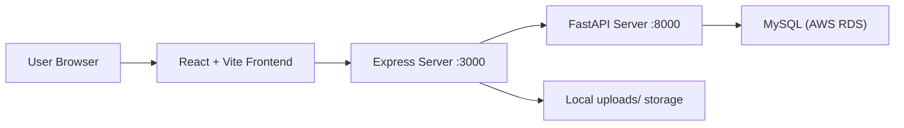

### 2-2. Responsibility Split

| Layer | Main Responsibility |
|---|---|
| React | 화면 렌더링, 라우팅, 입력 처리, 로컬 UI 상태 관리 |
| Express | 세션 쿠키 처리, 인증 검사, FastAPI 프록시/브리지, 파일 업로드 저장 |
| FastAPI | 실제 DB CRUD, 소유권 검증, 피드/좋아요/댓글/완료기록 처리 |
| MySQL | 사용자/루틴/완료/피드/좋아요/댓글 영속 저장 |
| uploads 폴더 | 이미지/영상 바이너리 파일 저장 |

현재 구조는 "Frontend -> Express -> FastAPI -> DB"의 2단 백엔드 구조이며, Express는 인증/파일 업로드 허브 역할, FastAPI는 데이터 처리 계층 역할을 한다.

## 3. Repository Structure

```text
capston-main/
├── src/frontend/           React 화면 로직
├── src/css/                전역/페이지 스타일
├── src/backend/            Express 서버
│   ├── app.js              서버 진입점
│   ├── database.js         Express -> FastAPI 브리지
│   ├── middleware/
│   │   └── requireAuth.js  세션 인증 미들웨어
│   ├── routes/             기능별 Express 라우터
│   └── uploads/            피드 첨부 이미지/영상 저장소
└── src/python_api/         FastAPI 서버
    ├── app.py              FastAPI 진입점
    ├── database.py         MySQL 커넥션 생성
    └── routers/            기능별 FastAPI 라우터
```

## 4. Frontend Architecture

### 4-1. Core Components

| File | Role |
|---|---|
| `src/frontend/main.jsx` | `BrowserRouter`로 앱 부트스트랩 |
| `src/frontend/App.jsx` | 전역 로그인 상태, 루틴 상태, 라우트 구성 |
| `src/frontend/LoginPage.jsx` | 로그인 요청 |
| `src/frontend/SignupPage.jsx` | 회원가입 + 실시간 유효성 검사 + 중복체크 |
| `src/frontend/HomePage.jsx` | 오늘 루틴 목록 / 완료 / 상세 인증 |
| `src/frontend/RoutinePage.jsx` | 루틴 CRUD 화면 |
| `src/frontend/FeedPage.jsx` | 피드 목록 / 좋아요 / 댓글 모달 |
| `src/frontend/MyPage.jsx` | 유저 정보 / 최근 활동 |

### 4-2. State Ownership

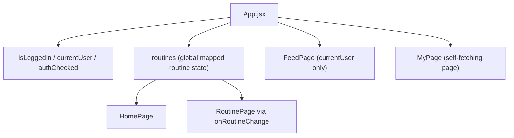

현재 프론트의 핵심은 `App.jsx`가 루틴 상태의 단일 진실 공급원 역할을 한다는 점이다.

- 로그인 성공 시 `currentUser` 로드
- 동시에 `/routine`, `/completion/today`를 읽어 오늘 완료 상태를 루틴 상태에 병합
- `HomePage`는 이 상태를 받아 렌더링
- `RoutinePage`는 루틴 추가/삭제 후 `onRoutineChange()`를 호출해 다시 동기화

## 5. Backend Architecture

### 5-1. Express Layer

Express는 다음 책임을 가진다.

1. 세션 쿠키 처리 (`cookie-parser`)
2. CORS 허용
3. `/uploads` 정적 파일 서빙
4. `requireAuth`를 통한 보호 라우트 인증
5. `database.js`를 통한 FastAPI 호출
6. `multer`를 통한 multipart 업로드
7. 글로벌 에러 핸들러로 JSON 에러 응답 통일

### 5-2. Express Internal Flow

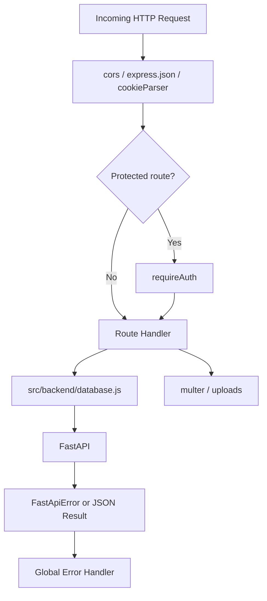

### 5-3. FastAPI Layer

FastAPI는 pure CRUD/API 계층으로 쓰이고 있다.

| Router | Role |
|---|---|
| `user.py` | 회원가입, 유저 조회, 세션 저장/조회/삭제, 중복체크 |
| `routine.py` | 루틴 생성/조회/삭제 |
| `completion.py` | 완료 기록 생성/오늘 조회/이력 조회/취소 |
| `feed.py` | 피드 생성/이미지 저장/목록 조회/상세 조회/삭제 |
| `like.py` | 좋아요 토글/조회 |
| `comment.py` | 댓글 생성/조회/삭제 |

## 6. Authentication Model

현재 인증은 JWT가 아니라 **DB 세션 + 쿠키 기반**이다.

### 6-1. Login / Session Flow

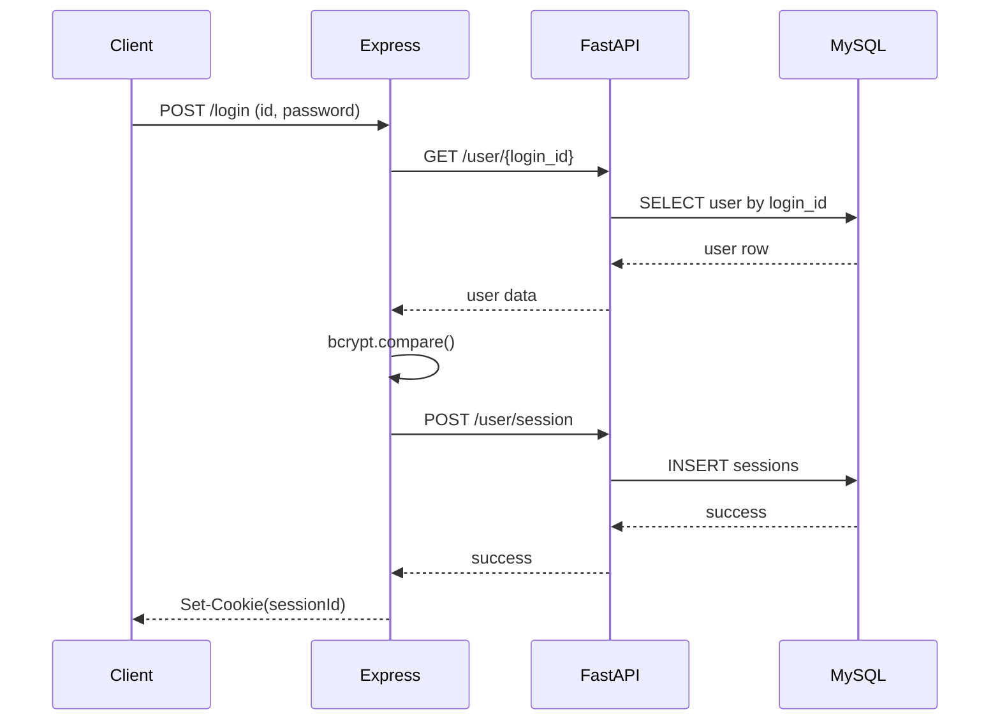

### 6-2. Protected Route Flow

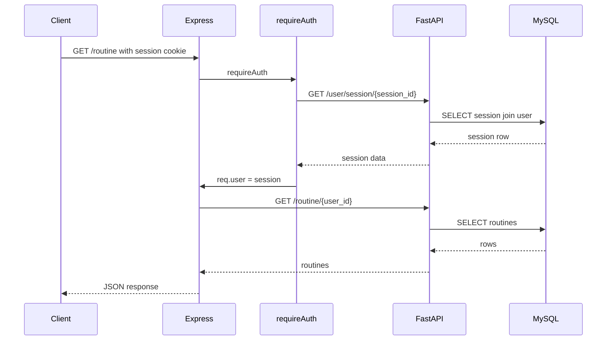

## 7. Domain Model

### 7-1. Entity Relationship

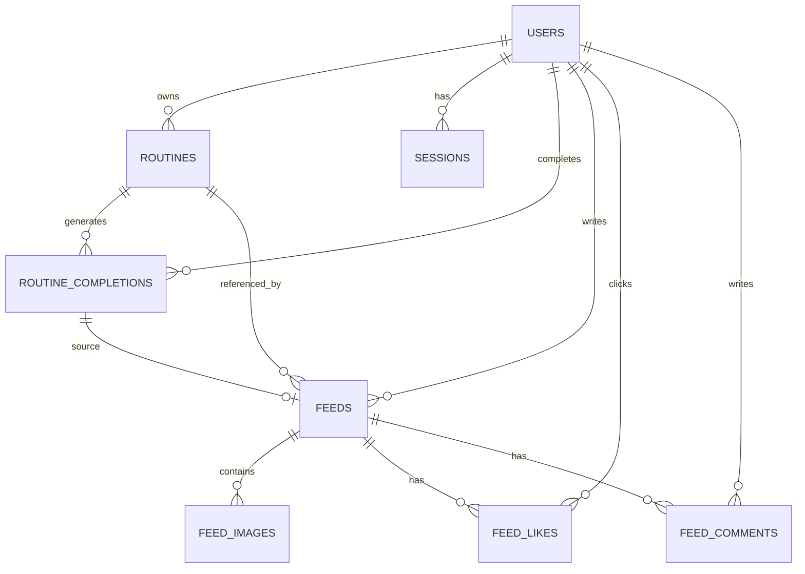

### 7-2. Main Tables

| Table | Meaning |
|---|---|
| `users` | 계정 정보 |
| `sessions` | 로그인 세션 |
| `routines` | 유저가 만든 루틴 |
| `routine_completions` | 특정 날짜/시점의 루틴 완료 기록 |
| `feeds` | 상세 인증 루틴에서 생성된 게시물 |
| `feed_images` | 게시물 첨부 파일 메타데이터 |
| `feed_likes` | 좋아요 |
| `feed_comments` | 댓글 |

## 8. Feature Flows

### 8-1. Routine CRUD

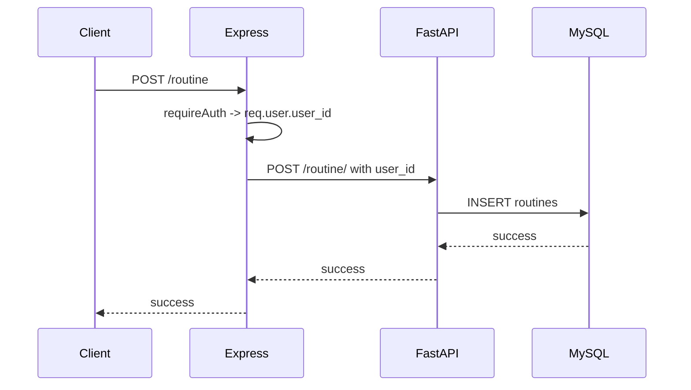

루틴 조회는 `GET /routine`, 삭제는 `DELETE /routine/:routine_id`이며, 삭제 시 FastAPI에서 `WHERE routine_id = ? AND user_id = ?`로 소유권을 검증한다.

### 8-2. App Bootstrap / Today Completion Restore

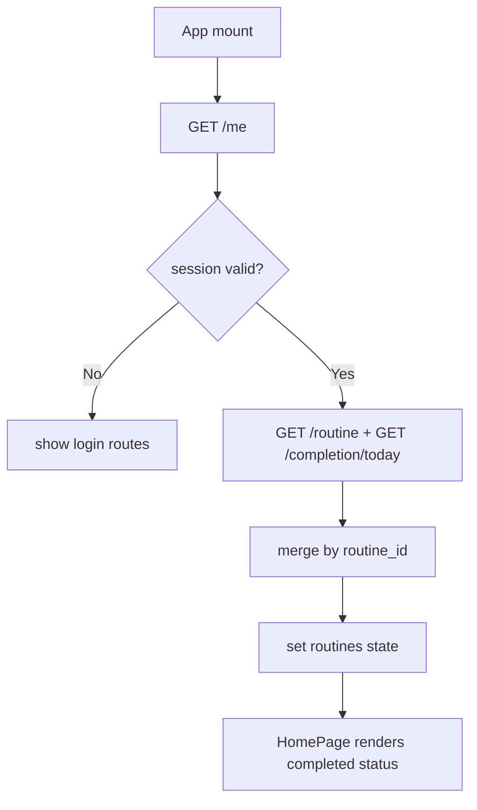

### 8-3. Check Routine Completion

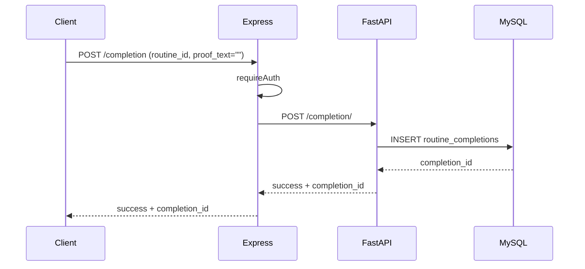

### 8-4. Detail Routine Completion + Feed Upload

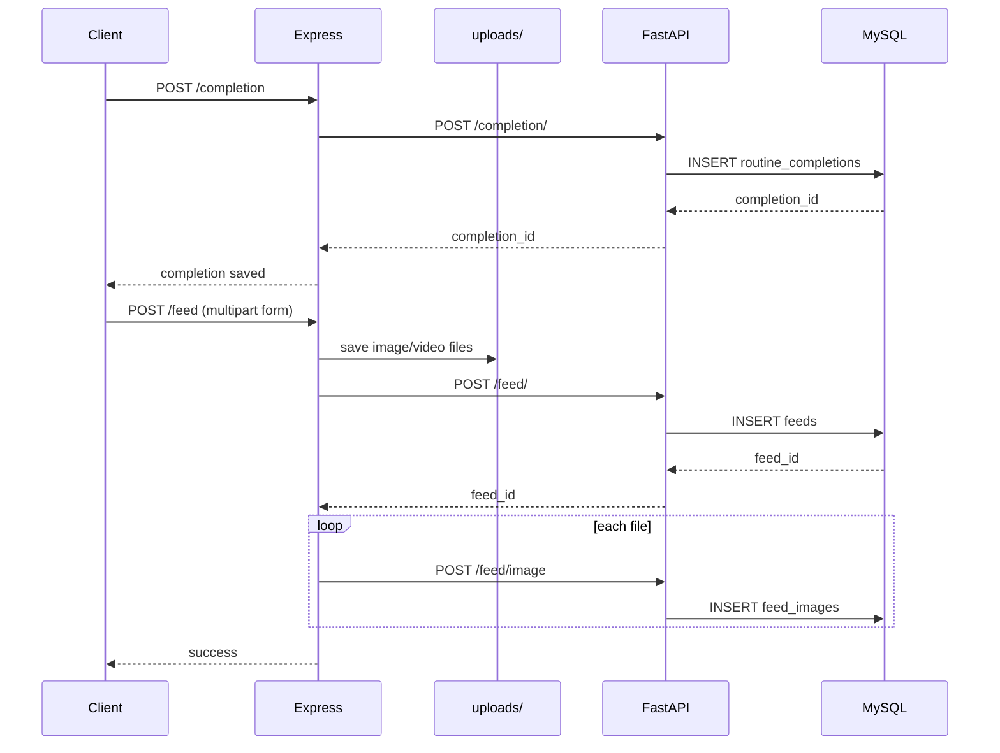

핵심 포인트:

- 완료 기록과 피드 게시물은 분리된 개념이다.
- 상세 루틴 완료를 먼저 저장하고, 이후 선택적으로 피드 게시물을 생성한다.
- 실제 바이너리 파일은 DB가 아니라 `src/backend/uploads/`에 저장된다.
- DB에는 `file_url`, `file_type`만 저장된다.

### 8-5. Feed Read Flow

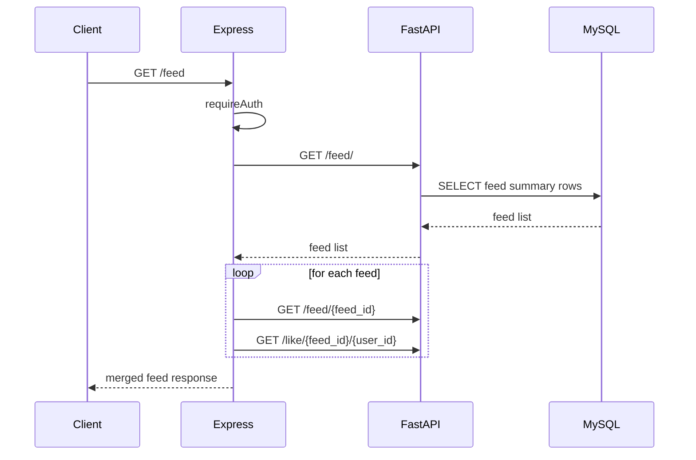

현재 피드 조회는 Express가 feed summary를 받고 각 피드별로 상세/좋아요 여부를 추가 조회하는 구조다.  
즉, 기능적으로는 단순하지만 성능 관점에서는 N+1 문제를 가진다.

### 8-6. Like Toggle Flow

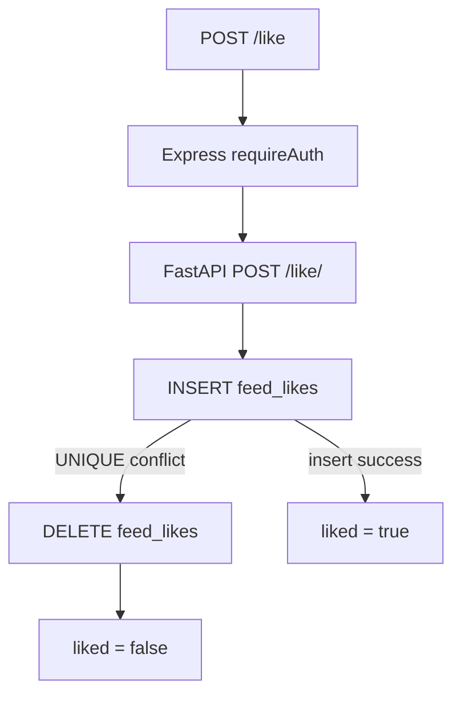

### 8-7. Comment Flow

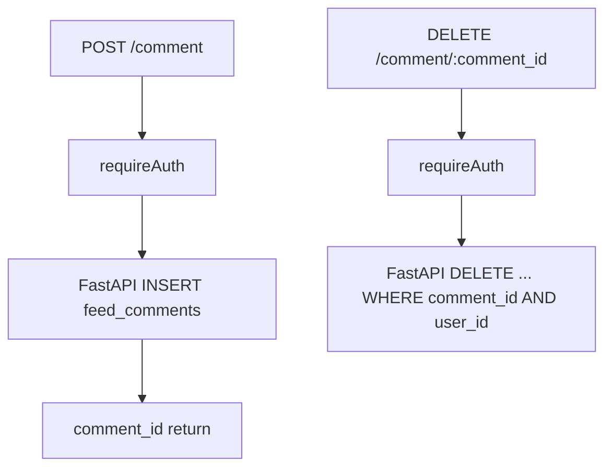

## 9. Error Handling Strategy

### 9-1. Current Strategy

- Express `database.js`에서 `fetchJson()` 공통 헬퍼로 FastAPI 응답을 파싱
- `FastApiError`로 네트워크/파싱/업스트림 실패를 표준화
- Express 글로벌 에러 핸들러에서 모든 실패를 JSON `{ success: false, message }`로 통일
- 인증은 `requireAuth`에서 선제적으로 401 차단

### 9-2. Why This Matters

이전에는 FastAPI가 HTML 500이나 비정상 응답을 반환하면 프론트의 `res.json()` 단계에서 2차 크래시가 날 수 있었다.  
현재는 최소한 "JSON 형식으로 실패를 전달"하는 구조는 잡혀 있다.

## 10. Known Technical Debt

현재 코드 기준으로 팀이 알고 있어야 하는 주요 남은 이슈:

1. **타임존 이슈**
   - `completion.py`의 오늘 완료 조회가 `CURDATE()` 기반
   - DB 서버 타임존이 KST가 아니면 자정 근처 완료 기록이 틀어질 수 있음

2. **피드 업로드 파일 정리 미흡**
   - 업로드 후 DB 실패 시 저장된 파일 정리 로직 부족
   - 피드 삭제 시 파일 시스템 정리 없음

3. **피드 조회 N+1**
   - `GET /feed` 이후 피드별 상세/좋아요 여부 재조회
   - 게시물 수가 늘면 병목이 커질 구조

4. **평문 비밀번호 폴백**
   - 기존 계정 호환을 위한 분기 로직이 로그인에 남아 있음

5. **DB 커넥션 풀 없음**
   - FastAPI는 요청마다 새 MySQL 연결 생성

6. **프론트 일부 로컬 상태 의존**
   - 상세 인증 완료 후 보여주는 `proofFiles`는 재fetch 시 복원되지 않음

## 11. Team Presentation Script

팀 설명을 짧게 할 때는 아래 순서를 추천한다.

1. **서비스 정의**
   - "루틴 생성/완료/인증/피드 공유 서비스"

2. **왜 백엔드가 두 개냐**
   - Express: 인증, 쿠키, 업로드, 브리지
   - FastAPI: 실제 CRUD와 DB 처리

3. **핵심 상태는 어디 있냐**
   - `App.jsx`가 로그인 상태와 루틴 상태를 중앙 관리

4. **루틴 완료는 어떻게 저장되냐**
   - 완료 기록을 먼저 저장하고, 상세 루틴이면 피드로 확장

5. **이미지/영상은 어디 가냐**
   - 파일은 Express `uploads/`
   - 경로 메타데이터만 DB에 저장

6. **현재 병목은 뭐냐**
   - 피드 조회 성능, 타임존, 파일 정리

## 12. Reference Files

핵심 설명 시 같이 열어두면 좋은 파일:

- [src/frontend/App.jsx](/Users/sayongja/ProjectFile/capston-main/src/frontend/App.jsx)
- [src/frontend/HomePage.jsx](/Users/sayongja/ProjectFile/capston-main/src/frontend/HomePage.jsx)
- [src/frontend/FeedPage.jsx](/Users/sayongja/ProjectFile/capston-main/src/frontend/FeedPage.jsx)
- [src/backend/app.js](/Users/sayongja/ProjectFile/capston-main/src/backend/app.js)
- [src/backend/database.js](/Users/sayongja/ProjectFile/capston-main/src/backend/database.js)
- [src/backend/middleware/requireAuth.js](/Users/sayongja/ProjectFile/capston-main/src/backend/middleware/requireAuth.js)
- [src/backend/routes/feed.js](/Users/sayongja/ProjectFile/capston-main/src/backend/routes/feed.js)
- [src/python_api/routers/completion.py](/Users/sayongja/ProjectFile/capston-main/src/python_api/routers/completion.py)
- [src/python_api/routers/feed.py](/Users/sayongja/ProjectFile/capston-main/src/python_api/routers/feed.py)

