# Routine Mate Architecture Overview

이 문서는 현재 `Routine Mate` 프로젝트를 팀 내부에서 설명할 때 바로 사용할 수 있는 전공자용 아키텍처 문서다.

기준 시점은 **2026-05-11 현재 워크스페이스 코드**이며, `README.md`의 2026-05-10 작업 내역까지 반영한다. 핵심 구조는 계속 **React -> Express -> FastAPI -> MySQL** 이고, 이 구조를 갈아엎지 않는 방향으로 보안/통계/성능 개선을 추가했다.

## 1. Project Summary

Routine Mate는 사용자의 루틴을 생성/조회/삭제하고, 하루 단위 완료 기록을 남기며, 상세 인증형 루틴은 피드 게시물로 확장할 수 있는 서비스다.

핵심 구현 범위:

- 회원가입 / 로그인 / 로그아웃
- DB 세션 + httpOnly 쿠키 기반 인증
- 루틴 CRUD
- 루틴 완료 기록 생성 / 오늘 완료 상태 복구 / 완료 취소
- 상세 루틴 인증 글 + 이미지/영상 S3 업로드
- 피드 목록 조회, 커서 기반 페이지네이션, 무한 스크롤
- 좋아요 토글
- 댓글 작성 / 조회 / 삭제
- 마이페이지 summary / gallery 실제 데이터 조회
- 상세 통계 weekly / monthly 실제 데이터 조회
- FastAPI 내부 호출 인증 헤더
- FastAPI MySQL 커넥션 풀, slow request / slow SQL 로그

## 2. Runtime Architecture

### 2-1. High-Level Topology

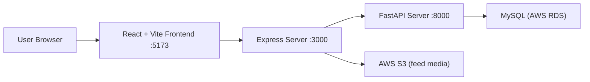
```mermaid
flowchart LR
    U["User Browser"] --> FE["React + Vite Frontend :5173"]
    FE --> EX["Express Server :3000"]
    EX --> FA["FastAPI Server :8000"]
    FA --> DB["MySQL (AWS RDS)"]
    EX --> S3["AWS S3 (feed media)"]
```

현재 구조는 **Frontend -> Express -> FastAPI -> DB** 의 2단 백엔드 구조다. Express는 사용자 인증, 세션 쿠키, S3 업로드, FastAPI 브리지 역할을 하고, FastAPI는 실제 DB CRUD/집계/소유권 검증을 담당한다.

### 2-2. Responsibility Split

| Layer | Main Responsibility |
|---|---|
| React | 화면 렌더링, 라우팅, 입력 처리, 로컬 UI 상태 관리, API 호출 |
| Express | CORS, httpOnly 세션 쿠키, `requireAuth`, FastAPI 프록시, S3 multipart 업로드, 짧은 `/stats` 캐시, 글로벌 JSON 에러 처리 |
| FastAPI | 실제 DB CRUD, 소유권 검증, 마이페이지/통계 집계, 내부 인증 헤더 검증 |
| MySQL (AWS RDS) | 사용자/루틴/완료/피드/좋아요/댓글 영속 저장 |
| AWS S3 | 피드 이미지/영상 바이너리 저장 |

### 2-3. Internal FastAPI Guard

FastAPI는 공개 API가 아니라 Express 뒤의 내부 데이터 계층이다. 따라서 Express는 FastAPI 호출 시 `X-Internal-Api-Key` 헤더를 붙이고, FastAPI는 전역 미들웨어에서 이 값을 검증한다.

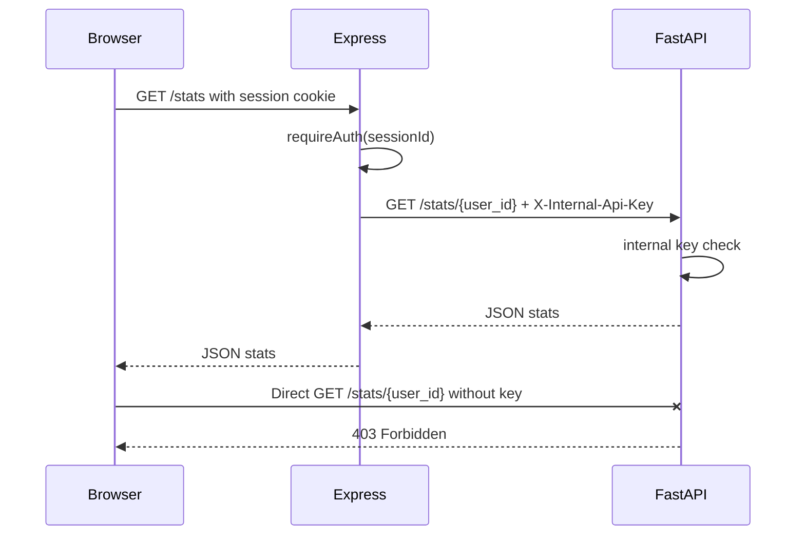
```mermaid
sequenceDiagram
    participant B as Browser
    participant E as Express
    participant F as FastAPI

    B->>E: GET /stats with session cookie
    E->>E: requireAuth(sessionId)
    E->>F: GET /stats/{user_id} + X-Internal-Api-Key
    F->>F: internal key check
    F-->>E: JSON stats
    E-->>B: JSON stats

    B-xF: Direct GET /stats/{user_id} without key
    F-->>B: 403 Forbidden
```

공개 예외 경로는 `/docs`, `/redoc`, `/openapi.json`, `/docs/oauth2-redirect`, `/favicon.ico`다. 실제 API는 내부 키가 없으면 차단된다.

## 3. Repository Structure

```text
capston-main/
├── src/frontend/               React 화면 로직
│   ├── App.jsx                 로그인/루틴 전역 상태 + 라우팅
│   ├── HomePage.jsx            오늘 루틴 / 완료 / 상세 인증
│   ├── RoutinePage.jsx         루틴 CRUD 화면
│   ├── FeedPage.jsx            피드 목록 / 좋아요 / 댓글 모달
│   ├── MyPage.jsx              마이페이지 실제 summary/gallery 표시
│   ├── StatsPage.jsx           weekly/monthly 상세 통계 표시
│   └── config.js               Express URL 중앙 관리
├── src/css/                    전역/페이지 스타일
├── src/backend/                Express 서버
│   ├── app.js                  서버 진입점, slow request 로그, 라우터 등록
│   ├── database.js             Express -> FastAPI 브리지 + 내부 인증 헤더
│   ├── middleware/
│   │   └── requireAuth.js      세션 인증 미들웨어
│   └── routes/
│       ├── login.js            인증 / 회원가입 / 중복체크
│       ├── routine.js          루틴 CRUD
│       ├── completion.js       완료 생성/오늘조회/이력/취소
│       ├── feed.js             S3 업로드 / 피드 조회 / 피드 삭제
│       ├── like.js             좋아요 토글
│       ├── comment.js          댓글 작성/조회/삭제
│       ├── mypage.js           마이페이지 통합/summary/gallery
│       └── stats.js            상세 통계 + 짧은 TTL 캐시
├── src/python_api/             FastAPI 서버
│   ├── app.py                  내부 인증 미들웨어 + slow request 로그 + 라우터 등록
│   ├── database.py             PyMySQL 커넥션 풀 + slow SQL 로그
│   └── routers/
│       ├── user.py             유저/세션/중복체크/password lazy migration
│       ├── routine.py          루틴 CRUD
│       ├── completion.py       완료 기록 + 소유권 검증
│       ├── feed.py             피드 CRUD + 소유권 검증 + 페이지네이션
│       ├── like.py             좋아요 토글
│       ├── comment.py          댓글 CRUD
│       ├── mypage.py           마이페이지 summary/gallery/overview
│       └── stats.py            주간/월간/시간대/카테고리 통계
└── docs/
    ├── architecture-overview.md
    └── performance-indexes-2026-05-10.sql
```

`src/backend/uploads/`는 과거 로컬 업로드 저장소의 흔적이며, 현재 신규 피드 파일은 S3에 저장된다. `/uploads` 정적 서빙도 제거되어 있다.

## 4. Frontend Architecture

### 4-1. Core Components

| File | Role |
|---|---|
| `src/frontend/main.jsx` | `BrowserRouter`로 앱 부트스트랩 |
| `src/frontend/App.jsx` | 로그인 상태, 현재 유저, 루틴 상태, 라우트 구성 |
| `src/frontend/LoginPage.jsx` | 로그인 요청 |
| `src/frontend/SignupPage.jsx` | 회원가입 + 실시간 유효성 검사 + 중복체크 |
| `src/frontend/HomePage.jsx` | 오늘 루틴 목록 / 완료 / 상세 인증 / 피드 업로드 선택 |
| `src/frontend/RoutinePage.jsx` | 루틴 CRUD 화면 |
| `src/frontend/FeedPage.jsx` | 커서 기반 피드 목록 / 좋아요 / 댓글 모달 |
| `src/frontend/MyPage.jsx` | `GET /mypage` 기반 유저 정보 + summary + gallery |
| `src/frontend/StatsPage.jsx` | `GET /stats` 기반 weekly/monthly 상세 분석 |

### 4-2. State Ownership

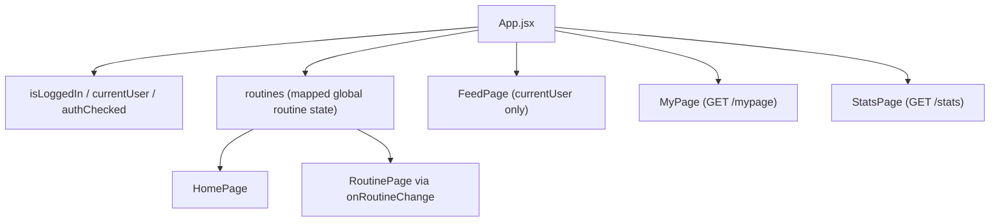
```mermaid
flowchart TD
    APP["App.jsx"] --> AUTH["isLoggedIn / currentUser / authChecked"]
    APP --> ROUTINES["routines (mapped global routine state)"]
    ROUTINES --> HOME["HomePage"]
    ROUTINES --> ROUTINE["RoutinePage via onRoutineChange"]
    APP --> FEED["FeedPage (currentUser only)"]
    APP --> MY["MyPage (GET /mypage)"]
    APP --> STATS["StatsPage (GET /stats)"]
```

핵심 상태 전략:

- `App.jsx`가 로그인 상태와 홈/루틴용 루틴 상태의 단일 진실 공급원 역할을 한다.
- 앱 부팅 시 `/me`로 세션을 복구하고, 성공하면 `/routine` + `/completion/today`를 읽어 오늘 완료 상태를 병합한다.
- `RoutinePage`는 루틴 추가/삭제 후 `onRoutineChange()`를 호출해 `App.jsx` 상태를 다시 동기화한다.
- `MyPage`는 화면 단위 통합 API인 `GET /mypage`를 한 번 호출한다.
- `StatsPage`는 선택한 weekly/monthly 날짜 범위로 `GET /stats`를 호출한다.

## 5. Backend Architecture

### 5-1. Express Layer

Express는 다음 책임을 가진다.

1. CORS 허용
2. JSON body 파싱
3. 세션 쿠키 파싱
4. `requireAuth`를 통한 보호 라우트 인증
5. `database.js`를 통한 FastAPI 호출
6. `X-Internal-Api-Key` 헤더를 FastAPI 호출에 자동 주입
7. `multer-s3`를 통한 S3 multipart 업로드
8. `/stats` 짧은 TTL 메모리 캐시
9. slow request 로그
10. 글로벌 에러 핸들러로 JSON 에러 응답 통일

### 5-2. Express Internal Flow

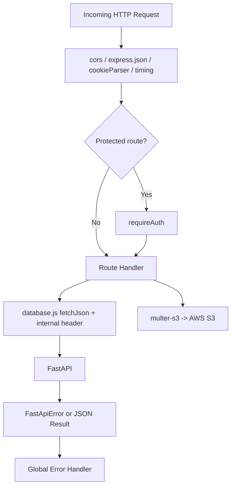
```mermaid
flowchart TD
    REQ["Incoming HTTP Request"] --> MW1["cors / express.json / cookieParser / timing"]
    MW1 --> AUTH{"Protected route?"}
    AUTH -- Yes --> MW2["requireAuth"]
    AUTH -- No --> RT["Route Handler"]
    MW2 --> RT
    RT --> DBJS["database.js fetchJson + internal header"]
    DBJS --> FAST["FastAPI"]
    RT --> S3UP["multer-s3 -> AWS S3"]
    FAST --> ERR["FastApiError or JSON Result"]
    ERR --> GEH["Global Error Handler"]
```

### 5-3. Express Routes

| Router | Public Express Routes |
|---|---|
| `routes/login.js` | `/signup`, `/login`, `/me`, `/logout`, `/check-duplicate` |
| `routes/routine.js` | `/routine`, `/routine/:routine_id` |
| `routes/completion.js` | `/completion`, `/completion/today`, `/completion/history`, `/completion/:completion_id` |
| `routes/feed.js` | `/feed`, `/feed/:feed_id` |
| `routes/like.js` | `/like` |
| `routes/comment.js` | `/comment`, `/comment/:feed_id`, `/comment/:comment_id` |
| `routes/mypage.js` | `/mypage`, `/mypage/summary`, `/mypage/gallery` |
| `routes/stats.js` | `/stats` |

### 5-4. FastAPI Layer

FastAPI는 DB CRUD/집계 계층으로 쓰인다.

| Router | Role |
|---|---|
| `user.py` | 회원가입, 유저 조회, 세션 저장/조회/삭제, 중복체크, password lazy migration |
| `routine.py` | 루틴 생성/조회/soft delete |
| `completion.py` | 완료 기록 생성/오늘 조회/이력 조회/soft delete, 완료 생성 전 루틴 소유권 검증 |
| `feed.py` | 피드 생성/이미지 저장/목록 조회/상세 조회/삭제, 피드 생성 전 completion/routine/user 관계 검증 |
| `like.py` | 좋아요 토글/조회 |
| `comment.py` | 댓글 생성/조회/삭제 |
| `mypage.py` | 유저 + summary + gallery 통합 조회, summary/gallery 단독 조회 |
| `stats.py` | weekly/monthly 통계, 시간대별 루틴 달성률, 카테고리 달성률, streak 계산 |

### 5-5. Database Connection Pool

`src/python_api/database.py`는 PyMySQL 기반 커넥션 풀을 제공한다.

| 항목 | 현재 동작 |
|---|---|
| 기본 풀 크기 | `DB_POOL_SIZE=8` |
| overflow | `DB_POOL_MAX_OVERFLOW=4` |
| close 동작 | 실제 종료가 아니라 풀 반환 |
| 타임존 | 커넥션 생성 시 `SET time_zone = '+09:00'` |
| slow SQL | `SLOW_QUERY_MS` 이상 SQL 로그 |

라우터의 기존 패턴은 그대로 유지된다.

```python
conn = get_connection()
try:
    with conn.cursor() as cursor:
        cursor.execute(...)
finally:
    conn.close()  # 실제 close가 아니라 풀 반환
```

## 6. Authentication And Authorization Model

현재 인증은 JWT가 아니라 **DB 세션 + httpOnly 쿠키 기반**이다.

### 6-1. Login / Session Flow

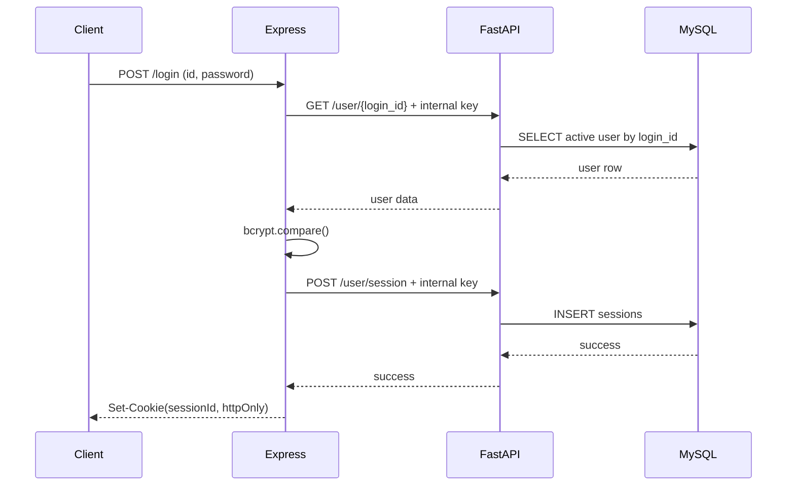
```mermaid
sequenceDiagram
    participant C as Client
    participant E as Express
    participant F as FastAPI
    participant D as MySQL

    C->>E: POST /login (id, password)
    E->>F: GET /user/{login_id} + internal key
    F->>D: SELECT active user by login_id
    D-->>F: user row
    F-->>E: user data
    E->>E: bcrypt.compare()
    E->>F: POST /user/session + internal key
    F->>D: INSERT sessions
    D-->>F: success
    F-->>E: success
    E-->>C: Set-Cookie(sessionId, httpOnly)
```

### 6-2. Protected Route Flow

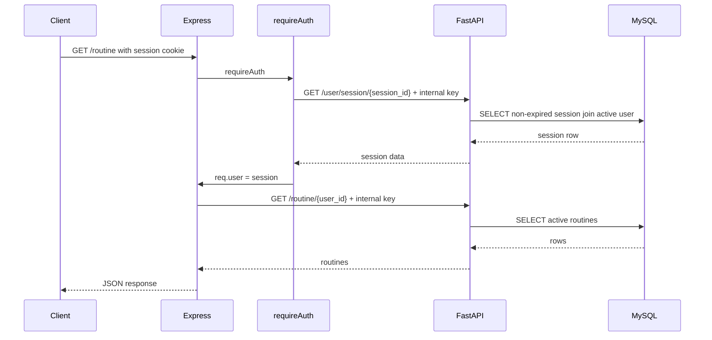
```mermaid
sequenceDiagram
    participant C as Client
    participant E as Express
    participant M as requireAuth
    participant F as FastAPI
    participant D as MySQL

    C->>E: GET /routine with session cookie
    E->>M: requireAuth
    M->>F: GET /user/session/{session_id} + internal key
    F->>D: SELECT non-expired session join active user
    D-->>F: session row
    F-->>M: session data
    M->>E: req.user = session
    E->>F: GET /routine/{user_id} + internal key
    F->>D: SELECT active routines
    D-->>F: rows
    F-->>E: routines
    E-->>C: JSON response
```

### 6-3. Authorization Checks

| Action | Authorization Rule |
|---|---|
| Routine delete | FastAPI `WHERE routine_id=? AND user_id=? AND deleted_at IS NULL` |
| Completion create | FastAPI verifies active `routine_id` belongs to `user_id` |
| Completion delete | FastAPI `WHERE completion_id=? AND user_id=? AND deleted_at IS NULL` |
| Feed create | FastAPI verifies `completion_id + routine_id + user_id` match an active completion |
| Feed delete | FastAPI `WHERE feed_id=? AND user_id=?` |
| Comment delete | FastAPI `WHERE comment_id=? AND user_id=?` |

## 7. Domain Model

### 7-1. Entity Relationship

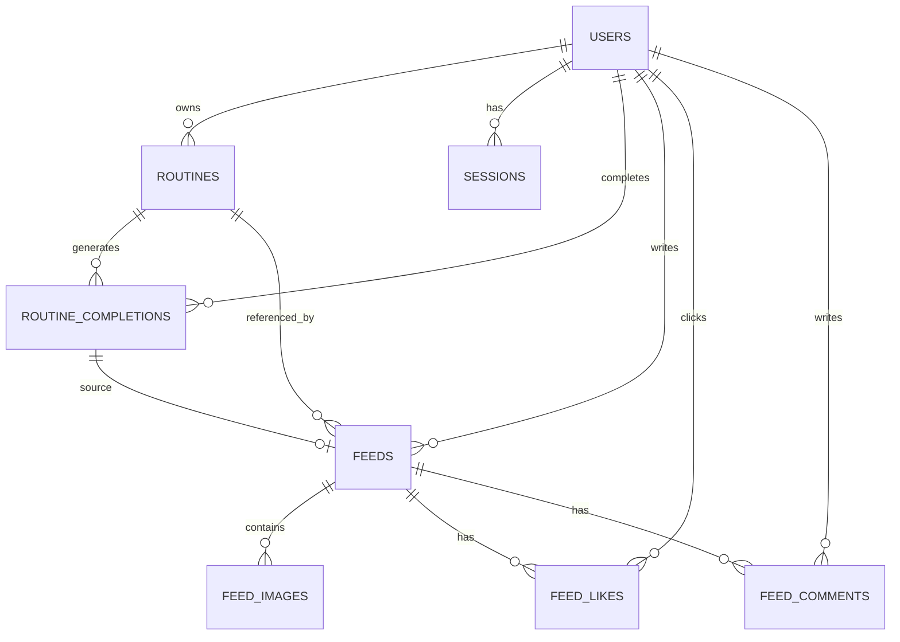
```mermaid
erDiagram
    USERS ||--o{ ROUTINES : owns
    USERS ||--o{ SESSIONS : has
    USERS ||--o{ ROUTINE_COMPLETIONS : completes
    USERS ||--o{ FEEDS : writes
    USERS ||--o{ FEED_LIKES : clicks
    USERS ||--o{ FEED_COMMENTS : writes

    ROUTINES ||--o{ ROUTINE_COMPLETIONS : generates
    ROUTINES ||--o{ FEEDS : referenced_by

    ROUTINE_COMPLETIONS ||--o| FEEDS : source

    FEEDS ||--o{ FEED_IMAGES : contains
    FEEDS ||--o{ FEED_LIKES : has
    FEEDS ||--o{ FEED_COMMENTS : has
```

### 7-2. Main Tables

| Table | Meaning |
|---|---|
| `users` | 계정 정보 (`deleted_at` soft delete 컬럼 보유) |
| `sessions` | 로그인 세션 |
| `routines` | 유저가 만든 루틴 (`deleted_at` soft delete 컬럼 보유) |
| `routine_completions` | 특정 날짜/시점의 루틴 완료 기록 (`deleted_at` soft delete 컬럼 보유) |
| `feeds` | 상세 인증 루틴에서 생성된 게시물 |
| `feed_images` | S3 파일 URL / MIME type 메타데이터 |
| `feed_likes` | 좋아요 |
| `feed_comments` | 댓글 |

> **Soft Delete 정책 (2026-05-01 도입)**
> `users` / `routines` / `routine_completions` 세 테이블은 행을 실제 삭제하지 않고 `deleted_at` 컬럼을 갱신하여 논리 삭제한다. 사용자 화면(루틴 목록, 오늘 완료 목록 등)에서는 `WHERE deleted_at IS NULL` 필터로 숨겨지지만, 피드/마이페이지 성격의 과거 인증 기록은 `LEFT JOIN + COALESCE` 로 `(삭제된 루틴)` / `(탈퇴한 사용자)` 라벨을 표시하며 보존한다.

## 8. Feature Flows

### 8-1. Routine CRUD

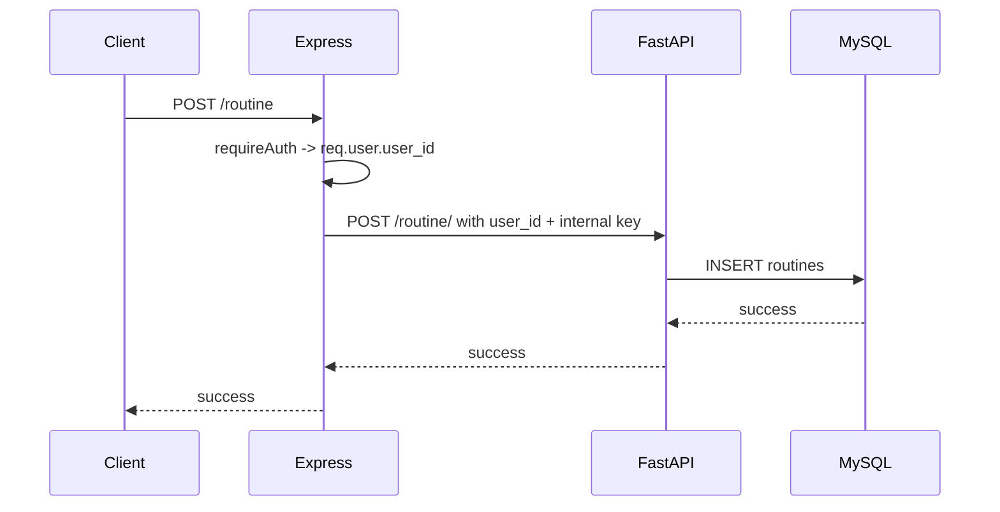
```mermaid
sequenceDiagram
    participant C as Client
    participant E as Express
    participant F as FastAPI
    participant D as MySQL

    C->>E: POST /routine
    E->>E: requireAuth -> req.user.user_id
    E->>F: POST /routine/ with user_id + internal key
    F->>D: INSERT routines
    D-->>F: success
    F-->>E: success
    E-->>C: success
```

루틴 삭제는 hard delete가 아니라 `deleted_at = NOW()` soft delete다.

### 8-2. App Bootstrap / Today Completion Restore

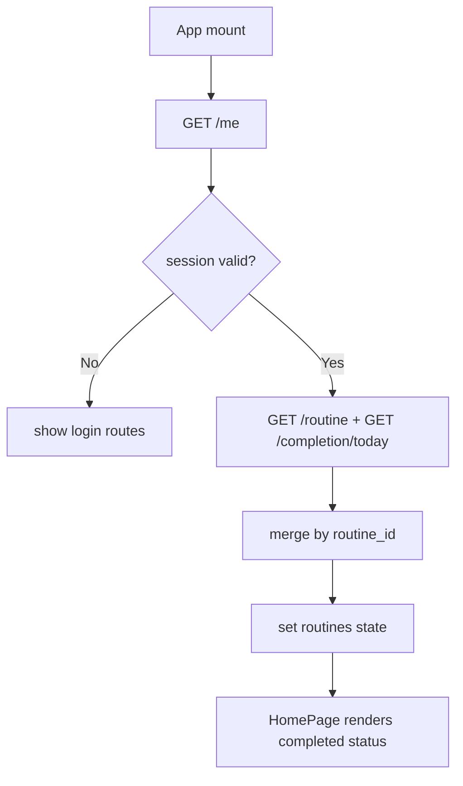
```mermaid
flowchart TD
    A["App mount"] --> B["GET /me"]
    B --> C{"session valid?"}
    C -- No --> D["show login routes"]
    C -- Yes --> E["GET /routine + GET /completion/today"]
    E --> F["merge by routine_id"]
    F --> G["set routines state"]
    G --> H["HomePage renders completed status"]
```

### 8-3. Check Routine Completion

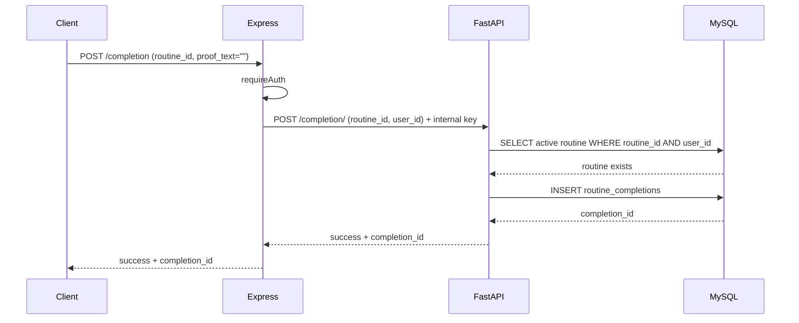
```mermaid
sequenceDiagram
    participant C as Client
    participant E as Express
    participant F as FastAPI
    participant D as MySQL

    C->>E: POST /completion (routine_id, proof_text="")
    E->>E: requireAuth
    E->>F: POST /completion/ (routine_id, user_id) + internal key
    F->>D: SELECT active routine WHERE routine_id AND user_id
    D-->>F: routine exists
    F->>D: INSERT routine_completions
    D-->>F: completion_id
    F-->>E: success + completion_id
    E-->>C: success + completion_id
```

### 8-4. Detail Routine Completion + S3 Feed Upload

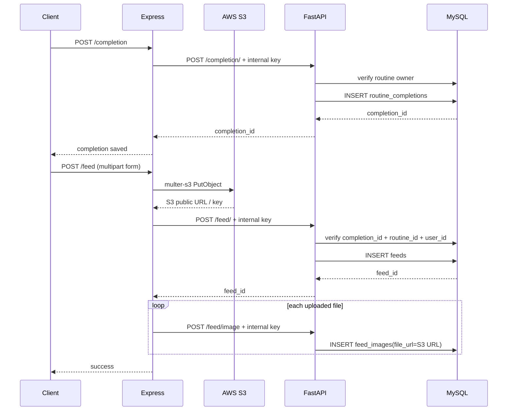
```mermaid
sequenceDiagram
    participant C as Client
    participant E as Express
    participant S as AWS S3
    participant F as FastAPI
    participant D as MySQL

    C->>E: POST /completion
    E->>F: POST /completion/ + internal key
    F->>D: verify routine owner
    F->>D: INSERT routine_completions
    D-->>F: completion_id
    F-->>E: completion_id
    E-->>C: completion saved

    C->>E: POST /feed (multipart form)
    E->>S: multer-s3 PutObject
    S-->>E: S3 public URL / key
    E->>F: POST /feed/ + internal key
    F->>D: verify completion_id + routine_id + user_id
    F->>D: INSERT feeds
    D-->>F: feed_id
    F-->>E: feed_id
    loop each uploaded file
        E->>F: POST /feed/image + internal key
        F->>D: INSERT feed_images(file_url=S3 URL)
    end
    E-->>C: success
```

핵심 포인트:

- 완료 기록과 피드 게시물은 분리된 개념이다.
- 상세 루틴 완료를 먼저 저장하고, 이후 선택적으로 피드 게시물을 생성한다.
- 실제 바이너리 파일은 DB가 아니라 AWS S3에 저장된다.
- DB에는 `file_url`, `file_type`만 저장된다.
- 검증 실패나 FastAPI 실패 시 Express는 업로드된 S3 객체를 정리한다.

### 8-5. Feed Read Flow

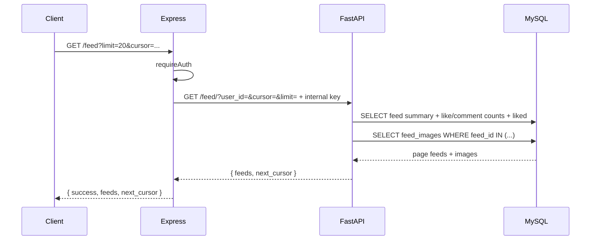
```mermaid
sequenceDiagram
    participant C as Client
    participant E as Express
    participant F as FastAPI
    participant D as MySQL

    C->>E: GET /feed?limit=20&cursor=...
    E->>E: requireAuth
    E->>F: GET /feed/?user_id=&cursor=&limit= + internal key
    F->>D: SELECT feed summary + like/comment counts + liked
    F->>D: SELECT feed_images WHERE feed_id IN (...)
    D-->>F: page feeds + images
    F-->>E: { feeds, next_cursor }
    E-->>C: { success, feeds, next_cursor }
```

2026-05-03 기준으로 기존 N+1 구조는 제거되었다. 댓글은 목록 응답에 포함하지 않고, 댓글 모달을 열 때 `GET /comment/:feed_id`로 별도 조회한다.

### 8-6. MyPage Flow

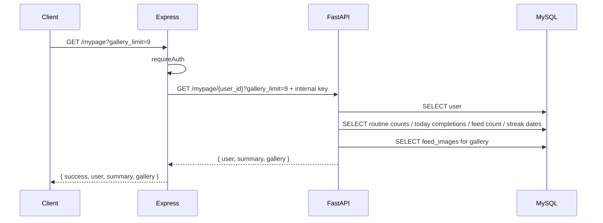
```mermaid
sequenceDiagram
    participant C as Client
    participant E as Express
    participant F as FastAPI
    participant D as MySQL

    C->>E: GET /mypage?gallery_limit=9
    E->>E: requireAuth
    E->>F: GET /mypage/{user_id}?gallery_limit=9 + internal key
    F->>D: SELECT user
    F->>D: SELECT routine counts / today completions / feed count / streak dates
    F->>D: SELECT feed_images for gallery
    F-->>E: { user, summary, gallery }
    E-->>C: { success, user, summary, gallery }
```

`MyPage.jsx`는 과거 `/me`, `/mypage/summary`, `/mypage/gallery`를 따로 호출하지 않고, 현재는 `/mypage` 하나로 화면 데이터를 받는다.

### 8-7. Stats Flow

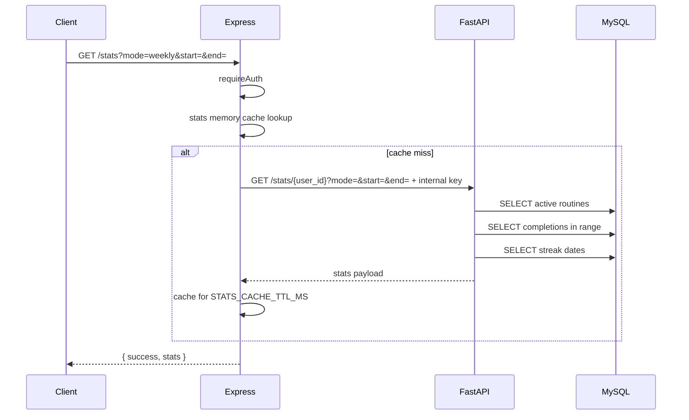
```mermaid
sequenceDiagram
    participant C as Client
    participant E as Express
    participant F as FastAPI
    participant D as MySQL

    C->>E: GET /stats?mode=weekly&start=&end=
    E->>E: requireAuth
    E->>E: stats memory cache lookup
    alt cache miss
        E->>F: GET /stats/{user_id}?mode=&start=&end= + internal key
        F->>D: SELECT active routines
        F->>D: SELECT completions in range
        F->>D: SELECT streak dates
        F-->>E: stats payload
        E->>E: cache for STATS_CACHE_TTL_MS
    end
    E-->>C: { success, stats }
```

현재 통계 계산 정책은 **활성 루틴 전체 × 기간 일수**를 목표량으로 사용한다. `repeat_cycle`이 자유 문자열이기 때문에 요일별 예정 루틴만 denominator에 넣는 계산은 아직 하지 않는다.

### 8-8. Like Toggle Flow

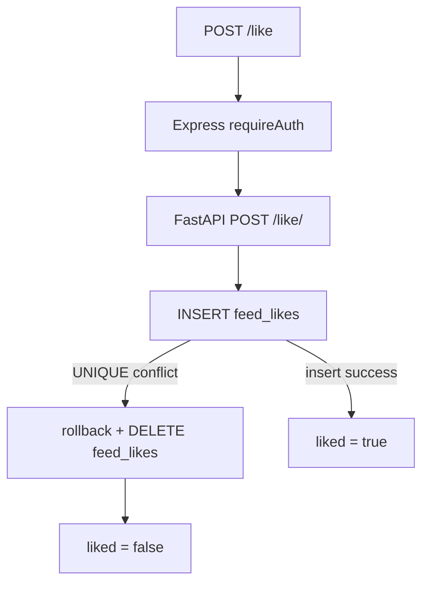
```mermaid
flowchart TD
    A["POST /like"] --> B["Express requireAuth"]
    B --> C["FastAPI POST /like/"]
    C --> D["INSERT feed_likes"]
    D -->|"UNIQUE conflict"| E["rollback + DELETE feed_likes"]
    D -->|"insert success"| F["liked = true"]
    E --> G["liked = false"]
```

`like.py`는 2026-05-02에 INSERT 실패 후 rollback을 수행하고 동일 커넥션에서 DELETE하는 패턴으로 정리되었다.

### 8-9. Comment Flow

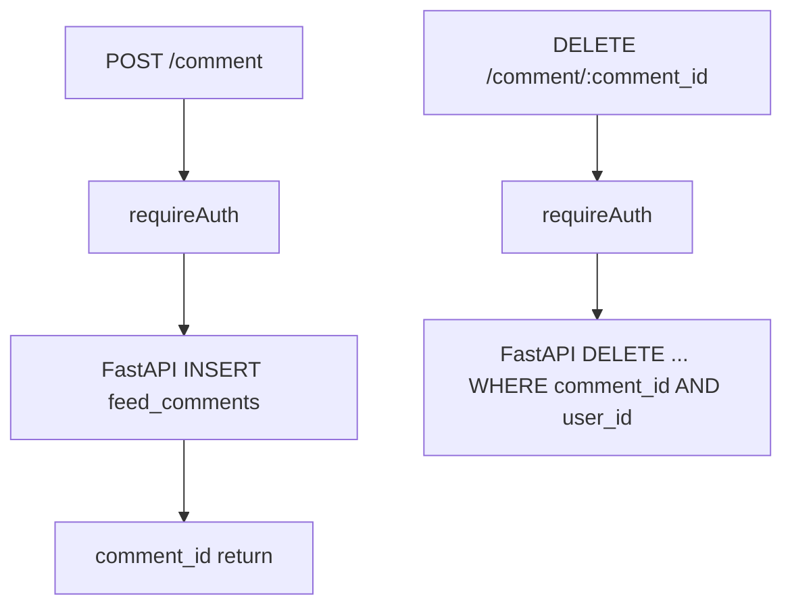
```mermaid
flowchart TD
    A["POST /comment"] --> B["requireAuth"]
    B --> C["FastAPI INSERT feed_comments"]
    C --> D["comment_id return"]

    E["DELETE /comment/:comment_id"] --> F["requireAuth"]
    F --> G["FastAPI DELETE ... WHERE comment_id AND user_id"]
```

## 9. Error Handling And Observability

### 9-1. Error Handling Strategy

- Express `database.js`에서 `fetchJson()` 공통 헬퍼로 FastAPI 응답을 파싱한다.
- FastAPI 4xx/5xx/비JSON/네트워크 실패를 `FastApiError`로 표준화한다.
- Express 글로벌 에러 핸들러에서 모든 실패를 JSON `{ success: false, message }`로 통일한다.
- 인증은 Express `requireAuth`에서 선제적으로 401 차단한다.
- FastAPI 직접 호출은 내부 인증 미들웨어에서 403 차단한다.

### 9-2. Observability

| Layer | Signal |
|---|---|
| Express | `SLOW_REQUEST_MS` 이상 요청을 `🐢 [express] ...` 로그로 출력 |
| FastAPI | `SLOW_REQUEST_MS` 이상 요청을 `🐢 [fastapi] ...` 로그로 출력 |
| MySQL | `SLOW_QUERY_MS` 이상 SQL을 `🐢 [slow-sql] ...` 로그로 출력 |

현재는 간단한 콘솔 로그 기반이다. 운영 전에는 traceId, structured logging, Sentry 같은 관측성 도구를 붙일 여지가 있다.

## 10. Performance Model

현재 구조를 유지하면서 성능을 높이는 방향은 다음과 같다.

1. FastAPI DB 커넥션 풀로 MySQL 연결 생성 비용 감소
2. 피드 목록 N+1 제거, 커서 기반 페이지네이션
3. 마이페이지 화면 단위 API(`/mypage`)로 왕복 횟수 감소
4. `/stats` 짧은 TTL 메모리 캐시
5. 이미지 lazy loading / async decoding / video metadata preload
6. RDS 적용용 인덱스 SQL 작성

인덱스 권장안은 `docs/performance-indexes-2026-05-10.sql`에 있다. 실제 RDS 적용 전에는 기존 인덱스 중복 여부를 확인해야 한다.

## 11. Known Technical Debt

현재 코드 기준으로 팀이 알고 있어야 하는 주요 남은 이슈:

1. **반복 주기 정규화 부족**
   - `repeat_cycle`이 문자열이라 통계 denominator가 "실제 예정 루틴" 기준이 아니다.
   - 정확한 통계를 위해 별도 repeat rule 테이블 또는 구조화된 JSON/ENUM이 필요하다.

2. **이미지/영상 썸네일 없음**
   - 현재 S3 원본 URL을 목록/갤러리에서도 사용한다.
   - `thumbnail_url`, WebP 변환, CloudFront 도입 시 체감 성능 개선 가능.

3. **세션 검증 캐시 없음**
   - 모든 보호 라우트에서 FastAPI 세션 조회가 발생한다.
   - 짧은 TTL LRU/Redis 캐시를 고려할 수 있으나, 로그아웃/만료 반영 지연 트레이드오프가 있다.

4. **Rate limiting 없음**
   - 로그인/회원가입/업로드 등 남용 방어가 아직 없다.

5. **운영 관측성 부족**
   - 현재는 콘솔 slow log 수준이다.
   - 운영 전 structured logging, traceId, Sentry 같은 체계가 필요하다.

6. **마이페이지/통계 캐시 무효화 단순함**
   - `/stats`는 TTL 캐시라 완료/취소 직후 최대 TTL만큼 늦게 반영될 수 있다.
   - 완료/취소/루틴 변경 시 명시적 cache invalidation을 붙일 수 있다.

7. **상세 인증 완료 직후 홈 카드 미디어는 프론트 로컬 blob 상태**
   - 새로고침 후 홈 카드의 `proofFiles` 미리보기는 복원되지 않는다.
   - 인증 파일은 피드/갤러리에서는 S3 URL로 확인 가능하다.

### 11-1. Resolved Highlights

- **타임존 이슈 (해결 2026-04-29)**
  - DB 커넥션 세션 타임존을 KST로 고정.
- **피드 업로드 파일 정리 미흡 (해결 2026-04-29, S3 전환 2026-05-05)**
  - 업로드 실패/피드 삭제 시 S3 객체 정리.
- **평문 비밀번호 폴백 (개선 2026-04-29, 내부 호출 방어 2026-05-10)**
  - 로그인 성공 시 bcrypt lazy migration.
  - FastAPI 내부 인증 헤더로 password update 직접 호출 위험 감소.
- **루틴/완료/유저 Soft Delete (도입 2026-05-01)**
  - 과거 인증 피드 보존.
- **피드 조회 N+1 (해결 2026-05-03)**
  - 단일 JOIN + 이미지 IN 쿼리 + 커서 페이지네이션.
- **로컬 업로드 저장소 문제 (해결 2026-05-05)**
  - 신규 피드 미디어 S3 업로드.
- **마이페이지/통계 mock 데이터 (해결 2026-05-10)**
  - `/mypage`, `/stats` 실제 DB 기반 API 연결.
- **DB 커넥션 풀 없음 (해결 2026-05-10)**
  - PyMySQL 커넥션 풀 도입.

## 12. Team Presentation Script

팀 설명을 짧게 할 때는 아래 순서를 추천한다.

1. **서비스 정의**
   - 루틴 생성/완료/인증/피드 공유 서비스.

2. **왜 백엔드가 두 개냐**
   - Express: 쿠키 세션, 인증, S3 업로드, FastAPI 브리지.
   - FastAPI: DB CRUD, 소유권 검증, 통계 집계.

3. **FastAPI는 공개 API냐**
   - 아니다. Express가 내부 인증 헤더를 붙여 호출하는 내부 데이터 계층이다.

4. **핵심 상태는 어디 있냐**
   - `App.jsx`가 로그인 상태와 홈/루틴용 루틴 상태를 중앙 관리한다.

5. **루틴 완료는 어떻게 저장되냐**
   - Express가 세션을 검증하고 FastAPI가 루틴 소유권을 다시 검증한 뒤 완료 기록을 만든다.

6. **상세 인증 파일은 어디 가냐**
   - 바이너리는 AWS S3, DB에는 S3 URL과 MIME type만 저장한다.

7. **피드는 어떻게 빠르게 읽냐**
   - FastAPI가 피드/좋아요/댓글 수/liked 상태를 JOIN으로 가져오고 이미지는 IN 쿼리로 묶어 가져온다.

8. **마이페이지/통계는 어떻게 계산하냐**
   - `/mypage`는 유저/summary/gallery를 한 번에 반환한다.
   - `/stats`는 weekly/monthly 기간 기준으로 루틴/완료 기록을 집계하고 Express에서 짧게 캐시한다.

9. **현재 남은 병목은 뭐냐**
   - 반복 주기 정규화, 썸네일/이미지 최적화, rate limiting, 운영 관측성.

## 13. Reference Files

핵심 설명 시 같이 열어두면 좋은 파일:

- [src/frontend/App.jsx](/Users/sayongja/ProjectFile/capston-main/src/frontend/App.jsx)
- [src/frontend/HomePage.jsx](/Users/sayongja/ProjectFile/capston-main/src/frontend/HomePage.jsx)
- [src/frontend/FeedPage.jsx](/Users/sayongja/ProjectFile/capston-main/src/frontend/FeedPage.jsx)
- [src/frontend/MyPage.jsx](/Users/sayongja/ProjectFile/capston-main/src/frontend/MyPage.jsx)
- [src/frontend/StatsPage.jsx](/Users/sayongja/ProjectFile/capston-main/src/frontend/StatsPage.jsx)
- [src/backend/app.js](/Users/sayongja/ProjectFile/capston-main/src/backend/app.js)
- [src/backend/database.js](/Users/sayongja/ProjectFile/capston-main/src/backend/database.js)
- [src/backend/middleware/requireAuth.js](/Users/sayongja/ProjectFile/capston-main/src/backend/middleware/requireAuth.js)
- [src/backend/routes/feed.js](/Users/sayongja/ProjectFile/capston-main/src/backend/routes/feed.js)
- [src/backend/routes/mypage.js](/Users/sayongja/ProjectFile/capston-main/src/backend/routes/mypage.js)
- [src/backend/routes/stats.js](/Users/sayongja/ProjectFile/capston-main/src/backend/routes/stats.js)
- [src/python_api/app.py](/Users/sayongja/ProjectFile/capston-main/src/python_api/app.py)
- [src/python_api/database.py](/Users/sayongja/ProjectFile/capston-main/src/python_api/database.py)
- [src/python_api/routers/completion.py](/Users/sayongja/ProjectFile/capston-main/src/python_api/routers/completion.py)
- [src/python_api/routers/feed.py](/Users/sayongja/ProjectFile/capston-main/src/python_api/routers/feed.py)
- [src/python_api/routers/mypage.py](/Users/sayongja/ProjectFile/capston-main/src/python_api/routers/mypage.py)
- [src/python_api/routers/stats.py](/Users/sayongja/ProjectFile/capston-main/src/python_api/routers/stats.py)
- [docs/performance-indexes-2026-05-10.sql](/Users/sayongja/ProjectFile/capston-main/docs/performance-indexes-2026-05-10.sql)
