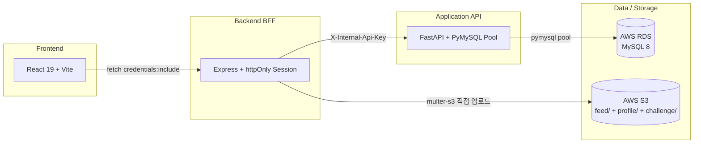

# 01. 프로젝트 개요

## 1.1 한 줄 정의

> **Routine Mate** 는 사용자가 직접 등록한 하루 단위 루틴을 시간대(아침 / 점심 / 저녁) 별로 수행·인증하고, 사진 피드와 챌린지를 통해 지속력을 보조하는 **루틴 관리 + 인증 SNS** 웹 서비스다.

## 1.2 해결하려는 문제

- 다이어트·운동·공부 등 자기 관리는 **혼자서는 지속이 어렵다.**
- 기존 To-do 앱은 "체크"만 가능해 인증 압력이 약하고, 인증 사진 SNS 는 "오늘 해야 할 일"을 보여주지 못한다.
- 따라서 **루틴 관리 + 인증 SNS + 챌린지 기반 강제력** 의 3 가지를 하나의 화면 흐름 안에 묶는다.

## 1.3 핵심 기능 (Feature Map)

| 영역 | 기능 | 화면 |
|------|------|------|
| 인증 | 회원가입 / 로그인 / 로그아웃 / 아이디·비밀번호 찾기 | `LoginPage.jsx`, `SignupPage.jsx` |
| 루틴 | 시간대별 등록 / 완료 체크 / Soft Delete | `RoutinePage.jsx` |
| 피드 | 사진·영상 인증 게시글 / 댓글 / 좋아요 / 무한 스크롤 | `FeedPage.jsx` |
| 마이페이지 | 프로필 편집(닉네임·자기소개·아바타) / 갤러리 / 핵심 지표 / 연속 달성 | `MyPage.jsx` |
| 챌린지 | 관리자 등록 / 참가 / 인증 / 인증 피드 공유 | `ChallengePage.jsx`, `AdminPage.jsx` |
| 통계 | 시간대별 / 주간 / 월간 달성률 차트 | `StatsPage.jsx` |
| 공지 | 관리자 공지 / 사용자 열람 | `NoticeList.jsx`, `NoticeDetail.jsx` |
| 신고 | 피드 신고(카테고리 6종 + 상세 사유) / 관리자 제재 처리 | `FeedPage.jsx` 내 모달, `AdminPage.jsx` |

## 1.4 기술 스택

| 계층 | 기술 |
|------|------|
| Frontend | React 19, Vite, Plain CSS (Tailwind 미사용) |
| BFF | Node.js 20, Express 5, DB 세션 쿠키, multer-s3, bcryptjs |
| Application API | Python 3.12, FastAPI, PyMySQL (Pool) |
| DB | MySQL 8 (AWS RDS) |
| Storage | AWS S3 (`feed/`, `profile/`, `challenge/` 프리픽스 분리) |
| 배포 | Docker Compose, Cloudflared Tunnel |
| 인증 | httpOnly 세션 쿠키 + bcrypt |
| ID 정책 | UUID v7 (`CHAR(36)`) |
| 시간대 | `Asia/Seoul` (KST) 통일 |

## 1.5 비기능 요구사항 (NFR)

- **보안**: FastAPI 는 외부에 직접 노출되지 않고 `X-Internal-Api-Key` 미들웨어로 1차 차단.
- **무결성**: 주요 도메인 테이블에 `deleted_at` 컬럼을 두고 해당 테이블 SELECT 에서 `IS NULL` 필터 (`feed_comments`·`feed_likes` 는 Hard Delete 예외).
- **회복력**: 라우터마다 `try / except + rollback + finally close` 패턴 강제, 커넥션 풀 누수 방지.
- **이식성**: 개발(`docker-compose.yml`) / 운영(`docker-compose.prod.yml`) 분리.
- **외부 노출**: 클라우드플레어 터널을 통해 EC2 외부 IP 노출 없이 HTTPS 종단.

## 1.6 페르소나

| 페르소나 | 사용 패턴 |
|----------|-----------|
| 자기 관리형 1인 사용자 | 아침/점심/저녁 루틴 등록 → 매일 인증 사진 업로드 → 연속 달성 streak 확인 |
| 챌린지 참가형 사용자 | 관리자가 개설한 챌린지 참가 → 인증 → 챌린지 피드에 자동 공유 |
| 관리자 | 챌린지 생성, 공지 게시, 신고 처리, 사용자 제재 (`AdminPage.jsx`) |

---

다음: [02. 시스템 아키텍처](./02-architecture.md)
