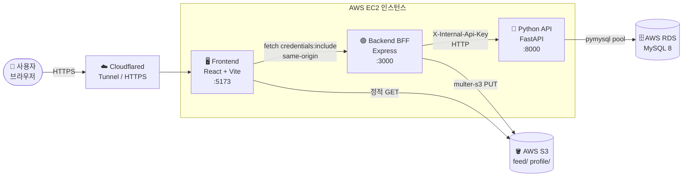
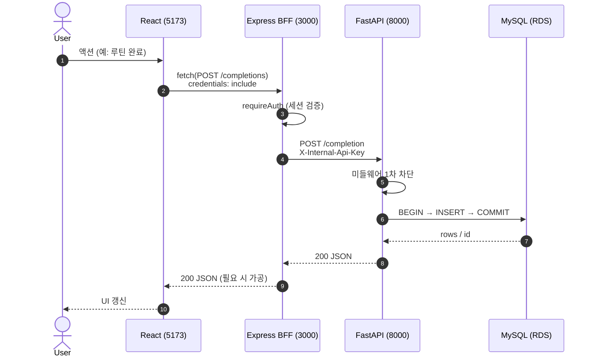

# 02. 시스템 아키텍처

## 2.1 한눈에 보는 토폴로지



## 2.2 왜 3-Tier(=BFF)인가

| 옵션 | 채택 여부 | 이유 |
|------|----------|------|
| React → FastAPI 직접 호출 | ❌ | 세션 쿠키를 React 가 직접 전달 → CORS·CSRF 위험. FastAPI 가 외부 공개. |
| Express + FastAPI 혼합(BFF) | ✅ | 세션·CORS·쿠키는 Express 가 차단, FastAPI 는 내부 전용. 책임 분리 명확. |
| FastAPI 단일 | ❌ | Node 생태계의 multer-s3 / bcrypt 세션 미들웨어 재구현 비용 큼. |

### 2.2.1 BFF 가 하는 일

- **세션 발급 / 검증** (`express-session` + httpOnly Cookie)
- **권한 가드** (`requireAuth`, `requireAdmin`)
- **S3 업로드 게이트키퍼** (multer-s3, 5MB / 50MB 제한, MIME 화이트리스트)
- **신뢰 경계 변환**: 외부 토큰 → 내부 `X-Internal-Api-Key`
- **검증·정규화** (이메일, 닉네임, 파일 타입)

### 2.2.2 FastAPI 가 하는 일

- **순수 도메인 로직** (루틴, 피드, 통계, 챌린지, 신고)
- **DB 트랜잭션 관리** (`try / except / rollback / finally close`)
- **연속 달성 / 달성률 계산 등 집계 쿼리**
- **외부 호출 X** — `X-Internal-Api-Key` 가 없는 요청은 1차 차단

## 2.3 디렉터리 구조

```
capston-main/
├── docker-compose.yml         # 로컬 개발용
├── docker-compose.prod.yml    # 운영 (Cloudflared 포함)
├── Dockerfile.frontend(.prod) # Vite build + serve
├── Dockerfile.backend(.prod)  # Node + Express
├── Dockerfile.python_api(.prod) # uvicorn + FastAPI
│
├── docs/                      # 인프라/마이그레이션/보고서
│   ├── architecture-overview.md
│   ├── deploy.md
│   ├── cloudflared-tunnel.md
│   ├── migrations-*.sql
│   └── report/                ← (본 폴더)
│
└── src/
    ├── frontend/              # React 18 + Vite
    │   ├── App.jsx            # Router
    │   ├── LoginPage.jsx / SignupPage.jsx
    │   ├── HomePage.jsx / RoutinePage.jsx
    │   ├── FeedPage.jsx / MyPage.jsx
    │   ├── ChallengePage.jsx / StatsPage.jsx
    │   ├── NoticeList.jsx / NoticeDetail.jsx
    │   ├── AdminPage.jsx
    │   └── config.js          # API_BASE 단일 출처
    │
    ├── backend/               # Express BFF
    │   ├── app.js             # 미들웨어/세션/라우터 등록
    │   ├── lib/s3.js          # S3 SDK + key 검증
    │   ├── middleware/        # requireAuth / requireAdmin
    │   └── routes/
    │       ├── login.js challenge.js
    │       ├── routine.js completion.js
    │       ├── feed.js comment.js like.js
    │       ├── mypage.js stats.js
    │       └── notice.js report.js
    │
    └── python_api/            # FastAPI
        ├── app.py             # 라우터 mount, INTERNAL_API_KEY 미들웨어
        ├── database.py        # pymysql 커넥션 풀
        └── routers/
            ├── user.py challenge.py
            ├── routine.py completion.py
            ├── feed.py comment.py like.py
            ├── mypage.py stats.py
            └── notice.py report.py
```

## 2.4 라우팅 매핑 (Frontend → Express → FastAPI)

| 화면 | Express 라우트 (`src/backend/routes/*.js`) | FastAPI 라우트 (`src/python_api/routers/*.py`) |
|------|--------------------------------------------|-----------------------------------------------|
| 로그인/회원가입 | `login.js` `POST /signup` `POST /login` `GET /me/profile` `PATCH /me/profile` `POST /find-id` `POST /find-password` | `user.py` `POST /user` `GET /user/profile/{id}` `PATCH /user/profile` `POST /user/find-id` `POST /user/find-password` |
| 루틴 | `routine.js` `/routines/*` | `routine.py` `/routine/*` |
| 완료 체크 | `completion.js` `/completions/*` | `completion.py` `/completion/*` |
| 피드 | `feed.js` `/feed/*` (multer-s3) | `feed.py` `/feed/*` |
| 댓글 / 좋아요 | `comment.js`, `like.js` | `comment.py`, `like.py` |
| 마이페이지 | `mypage.js` | `mypage.py` `/mypage/{id}`, `/summary/{id}`, `/gallery/{id}` |
| 통계 | `stats.js` | `stats.py` |
| 챌린지 | `challenge.js` (admin + 사용자) | `challenge.py` |
| 공지 | `notice.js` | `notice.py` |
| 신고 | `report.js` | `report.py` |

## 2.5 요청-응답 한 사이클



## 2.6 설계 원칙 정리

1. **Single Source of Truth (API_BASE)** — 프론트는 `config.js` 한 곳에서만 호스트 결정.
2. **신뢰 경계 명확화** — 세션은 Express, 내부 키는 FastAPI, 둘 다 통과해야 DB 접근 가능.
3. **풀 누수 0 정책** — FastAPI 모든 라우터: `conn = get_connection()` → `try / except rollback / finally conn.close()`.
4. **모든 도메인 Soft Delete** — `deleted_at IS NULL` 누락 = P0 버그로 취급.
5. **수정 자국 4 요소 주석** — 모든 코드 수정에 `오류번호 / 날짜 / 기대효과 / 장점` 4 항목을 강제.

---

이전: [01. 개요](./01-overview.md) · 다음: [03. 데이터 모델](./03-database.md)
