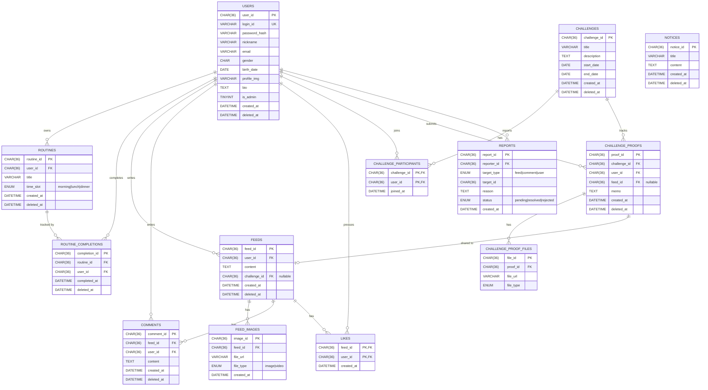

# 03. 데이터 모델 (DB)

> MySQL 8 (AWS RDS) 기반. 모든 PK 는 `CHAR(36) UUID v7`, 모든 도메인 테이블은 `deleted_at DATETIME NULL` 컬럼으로 **Soft Delete** 패턴 통일.

## 3.1 ER 다이어그램



## 3.2 테이블별 책임

| 테이블 | 역할 | 핵심 인덱스 |
|--------|------|------------|
| `users` | 계정 / 프로필 / 권한 | `UNIQUE(login_id)` |
| `routines` | 사용자별 시간대 루틴 | `(user_id, time_slot, deleted_at)` |
| `routine_completions` | 일자별 완료 기록 | `(user_id, completed_at)`, `(routine_id, completed_at)` |
| `feeds` | 인증 게시글 본문 | `(user_id, created_at)`, `(challenge_id)` |
| `feed_images` | 게시글 파일 (S3 URL) | `(feed_id, created_at)` |
| `comments` / `likes` | 게시글 소셜 액션 | `(feed_id)` |
| `challenges` | 관리자 챌린지 | `(deleted_at, start_date)` |
| `challenge_participants` | 참여 매핑 (복합 PK) | PK 자체 |
| `challenge_proofs` / `_files` | 인증 본문 + 파일 + 피드 공유 | `(challenge_id, user_id, created_at)` |
| `notices` | 공지 | `(created_at)` |
| `reports` | 사용자 신고 | `(target_type, target_id)` |

전체 인덱스 정의는 [`../performance-indexes-2026-05-10.sql`](../performance-indexes-2026-05-10.sql) 참고.

## 3.3 컨벤션

### 3.3.1 ID — UUID v7

- 모든 PK 는 `CHAR(36)`.
- v4 가 아니라 **v7** 사용 → 앞 비트가 타임스탬프라서 **B-Tree 인덱스에 단조 증가**, 페이지 분할 감소.
- 클라이언트가 ID 를 추측할 수 없어 보안상 시퀀셜 정수보다 안전.

### 3.3.2 Soft Delete

- 모든 도메인 테이블에 `deleted_at DATETIME NULL` 컬럼.
- **하드 삭제 금지**. `UPDATE ... SET deleted_at = NOW()`.
- 모든 SELECT 에서 `AND <table>.deleted_at IS NULL` 필수.
- 누락 = 데이터 무결성 P0 버그 (실제 사례: `mypage.py:_load_gallery` 2026-05-23 패치).

### 3.3.3 시간대

- DB / FastAPI / Express 모두 KST (`Asia/Seoul`) 통일.
- `CURDATE()`, `NOW()` 를 그대로 사용해도 동일 결과.

### 3.3.4 조인 패턴 (Soft Delete 된 사용자 참조)

```sql
SELECT
  f.feed_id,
  COALESCE(u.nickname, '(탈퇴 사용자)') AS author_nickname
FROM feeds f
LEFT JOIN users u
       ON u.user_id = f.user_id
      AND u.deleted_at IS NULL
WHERE f.deleted_at IS NULL
```

`LEFT JOIN + COALESCE` 로 탈퇴 사용자 게시글이 갑자기 사라지지 않도록 보호.

## 3.4 마이그레이션 이력

| 파일 | 내용 |
|------|------|
| `migrations-2026-05-10-performance-indexes.sql` (= `performance-indexes-*.sql`) | 핵심 조회 인덱스 추가 |
| `migrations-2026-05-13-admin-challenge.sql` | 챌린지·공지·신고 테이블 신설 |
| `migrations-2026-05-17-feeds-soft-delete.sql` | feeds 테이블 Soft Delete 컬럼 도입 |
| `migrations-2026-05-20-challenge-feed-share.sql` | 챌린지 인증 → 피드 자동 공유 (`feeds.challenge_id`) |
| `migrations-2026-05-20-users-bio.sql` | 자기소개(bio) 컬럼 추가 |

모든 마이그레이션은 `idempotent` (IF NOT EXISTS / ADD COLUMN IF NOT EXISTS) 로 작성되어 재실행 안전.

## 3.5 커넥션 풀 (`src/python_api/database.py`)

- PyMySQL + `DBUtils.PooledDB` 기반.
- 풀 누수 방지를 위해 모든 라우터에서:

```python
conn = get_connection()
try:
    with conn.cursor() as cursor:
        ...
except Exception as e:
    try: conn.rollback()
    except: pass
    raise HTTPException(500, str(e))
finally:
    conn.close()  # 실제 close 가 아니라 풀로 반환
```

→ 예외 경로에서도 반드시 풀에 반환되어 **장시간 운영 시에도 커넥션 누수 0**.

---

이전: [02. 아키텍처](./02-architecture.md) · 다음: [04. 인증·세션](./04-authentication.md)
