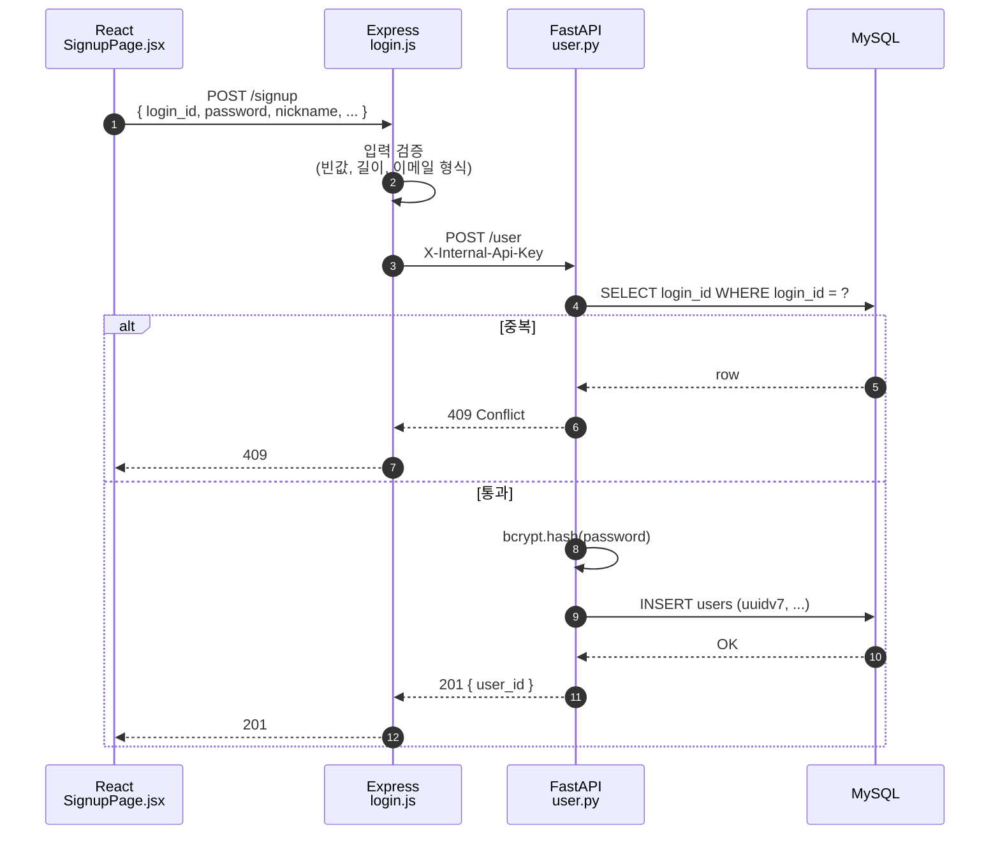
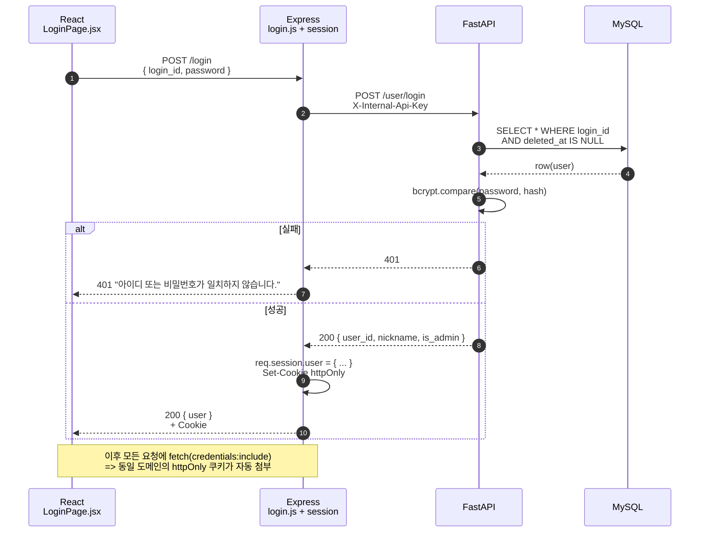
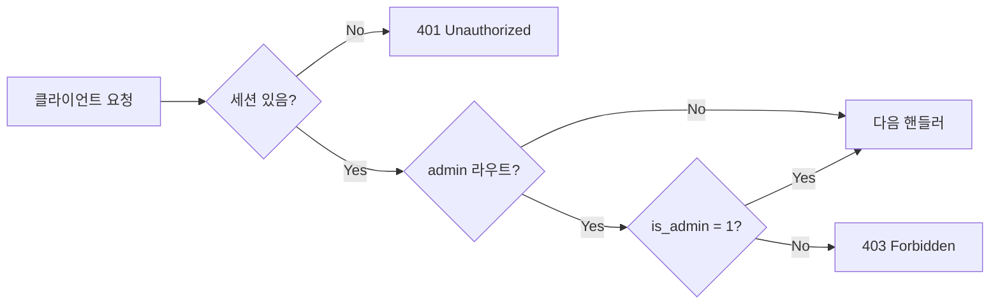
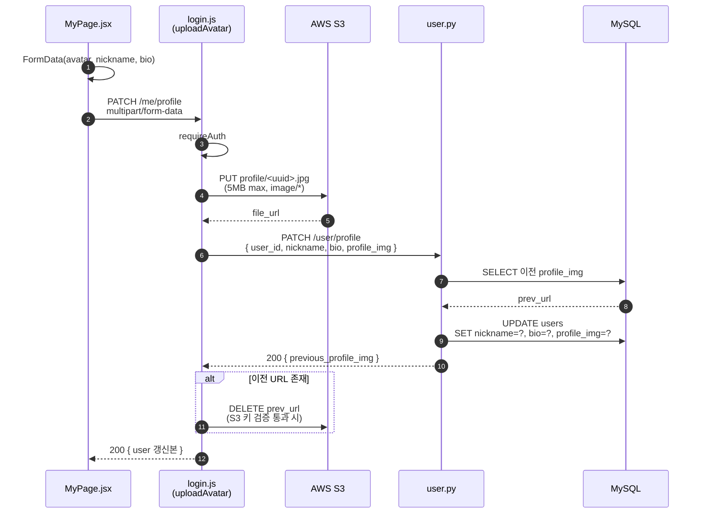

# 04. 인증 · 세션

## 4.1 인증 전략 개요

| 단계 | 사용 기술 | 비고 |
|------|----------|------|
| 비밀번호 저장 | `bcrypt` salt round 10 | 평문 / 단방향 해시 X |
| 세션 유지 | `express-session` + `httpOnly` 쿠키 | JS 에서 읽기 불가 → XSS 토큰 탈취 방어 |
| 권한 가드 | `requireAuth` / `requireAdmin` 미들웨어 | `is_admin = 1` 만 관리자 라우트 진입 |
| 내부 통신 | `X-Internal-Api-Key` 헤더 | FastAPI 미들웨어가 1차 차단 |

## 4.2 회원가입 흐름



핵심 검증 포인트:
- `login_id` UNIQUE 인덱스 + Express 사전 검증의 **이중화** → 동시 가입 레이스에서도 안전.
- 비밀번호는 FastAPI 진입 후 해시 → Express 로그에도 평문이 남지 않음.

## 4.3 로그인 / 세션 발급



쿠키 옵션 (운영):
- `httpOnly: true`
- `sameSite: "lax"`
- `secure: true` (HTTPS only, Cloudflared 종단 사용)
- `maxAge: 7d`

## 4.4 권한 가드 (`requireAuth` / `requireAdmin`)



- `requireAuth` 가 통과되지 않으면 라우터 본체는 절대 실행되지 않음.
- `requireAdmin` 은 `requireAuth` 통과 후에만 작동 (체이닝 순서 강제).

## 4.5 내부 API Key 게이트 (FastAPI)

FastAPI 는 외부에 직접 노출되지 않지만, 동일 EC2 내에서 우회 호출이 일어날 수 있으므로 **전역 미들웨어**로 헤더 검증:

```python
@app.middleware("http")
async def internal_api_key_guard(request, call_next):
    if request.headers.get("X-Internal-Api-Key") != INTERNAL_API_KEY:
        return JSONResponse(status_code=401, content={"detail": "Unauthorized"})
    return await call_next(request)
```

- 키는 환경 변수 (`INTERNAL_API_KEY`) — 컨테이너 build 산출물에 포함되지 않음.
- 운영 / 개발 별도 키.

## 4.6 아이디 / 비밀번호 찾기

| 흐름 | 구현 |
|------|------|
| 아이디 찾기 | 이름 + 이메일 매칭 → 일부 마스킹된 `login_id` 반환 |
| 비밀번호 재설정 | 본인 확인 정보 매칭 → 임시 비밀번호 발급 → bcrypt 저장 후 응답 |

> 운영 환경 보강 백로그: **Rate-limit (IP 당 1분 5회)**, **이메일 송신을 통한 토큰 기반 재설정**, **시도 횟수 잠금**.

## 4.7 프로필 편집 (아바타 포함)



핵심 안전 장치:
- S3 키 검증 (`extractS3Key`) — 호스트 / 프리픽스 / 경로 traversal 차단.
- FastAPI 가 실패하면 새로 업로드한 S3 객체를 **orphan 청소** (Express 에서 보상 삭제).
- 이전 사진은 응답으로 받은 `previous_profile_img` 만 삭제 → 다른 사용자 / 다른 도메인 파일은 절대 못 지움.

---

이전: [03. 데이터 모델](./03-database.md) · 다음: [05. 핵심 기능 흐름](./05-feature-flows.md)
