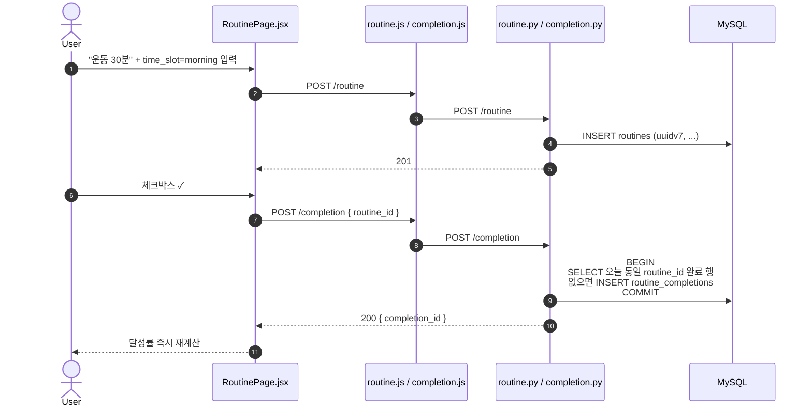
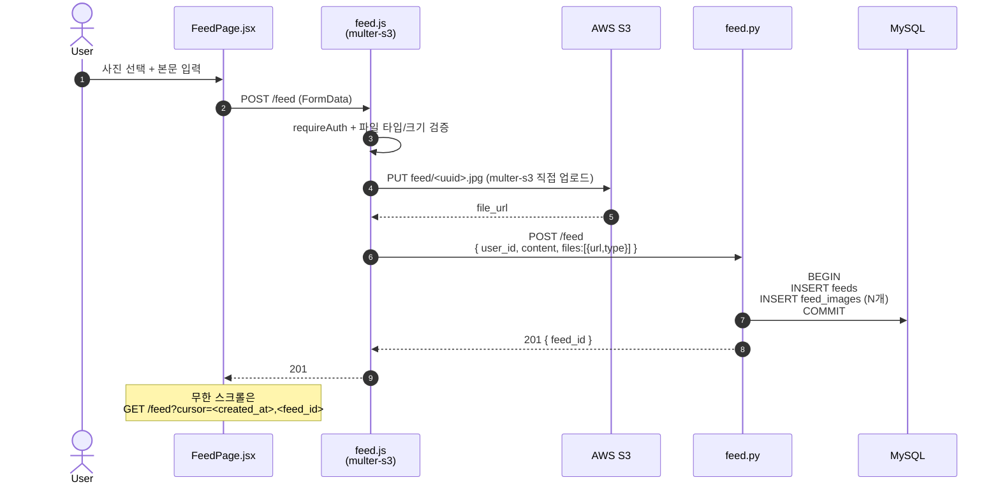
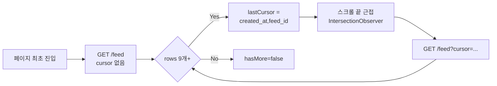
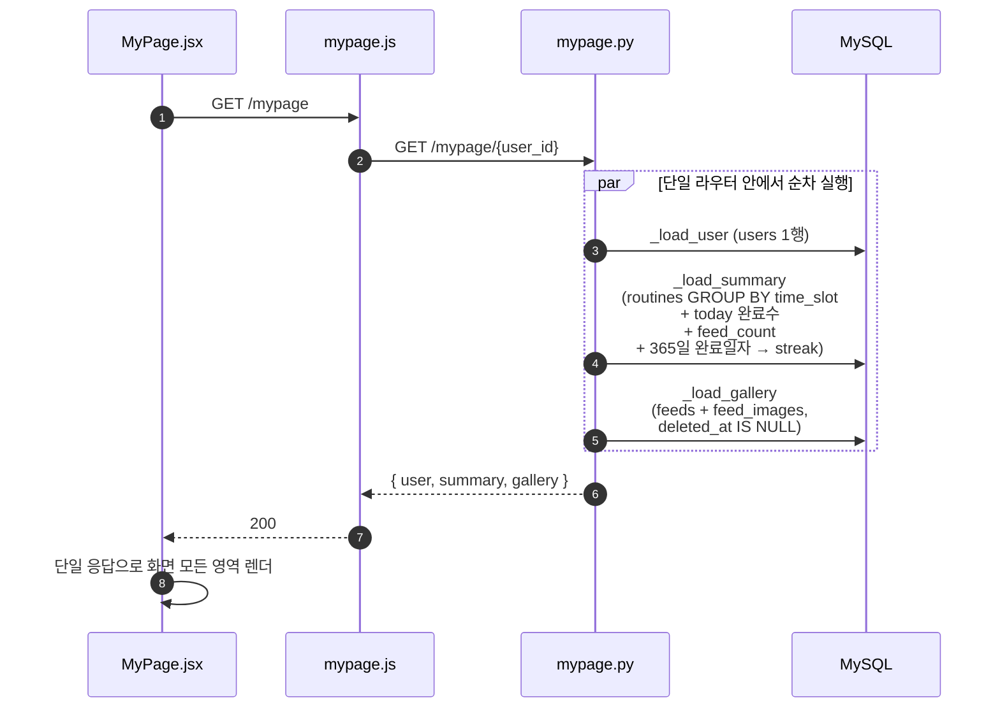
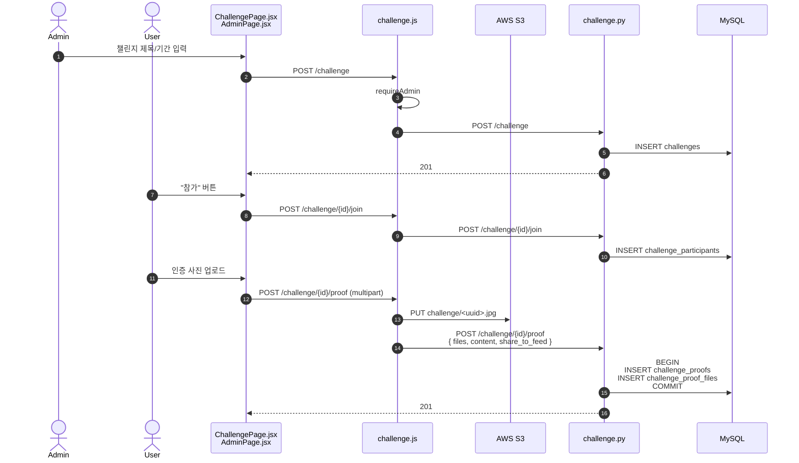
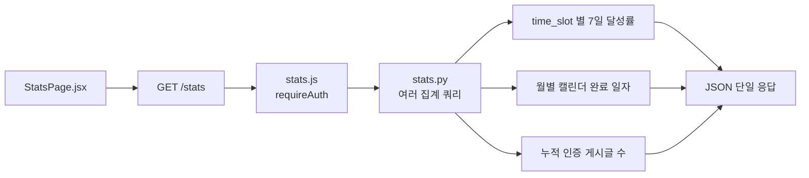

# 05. 핵심 기능 흐름

> 화면별로 클라이언트 → BFF → FastAPI → DB 까지의 시퀀스를 정리. 모든 라우트는 `requireAuth` 통과를 전제로 한다.

## 5.1 루틴 등록 & 완료 체크



특이점:
- "오늘 완료" 판단은 `DATE(completed_at) = CURDATE()` 기준.
- 동일 루틴을 하루에 여러 번 체크해도 **distinct routine_id 단위로 1회만 인정** (마이페이지 달성률 계산 동일 규칙).
- 체크 해제 = Soft Delete (`UPDATE routine_completions SET deleted_at = NOW()`).

## 5.2 피드 작성 (사진 인증)



설계 포인트:
- **multer-s3 가 EC2 임시 디스크를 건너뛰고 S3 로 다이렉트 PUT** → 디스크 IO 부하 0, 임시 파일 청소 불필요.
- FastAPI 가 INSERT 실패하면 Express 가 S3 객체를 보상 삭제 (orphan 청소).
- 피드 삭제 시: feed 행을 `deleted_at` 마킹 → 동시에 S3 객체도 검증 통과 시 삭제.

## 5.3 피드 무한 스크롤 (Cursor 기반)



- offset 페이지네이션 대비 **새 글이 추가/삭제돼도 중복/누락 없음**.
- 인덱스: `(created_at DESC, feed_id DESC)` 복합 사용으로 ORDER BY 정렬 안정.

## 5.4 마이페이지 통합 조회



`/mypage/{id}` 1 회 호출로 `user + summary + gallery` 가 모두 도착 → 화면 새로고침 시 N+1 호출 제거.

### 5.4.1 연속 달성 (streak) 계산

```python
def _calculate_current_streak(completion_dates, today):
    date_set = set(completion_dates)
    current = today
    streak = 0
    while current.isoformat() in date_set:
        streak += 1
        current -= timedelta(days=1)
    return streak
```

- 오늘부터 거꾸로 "하루에 1개 이상 완료" 가 끊기지 않는 길이.
- DB 가 아니라 애플리케이션에서 계산 → 인덱스만 잘 타면 O(N) (최근 365일 한정).

## 5.5 챌린지 (관리자 등록 → 참가 → 인증)



특이점:
- **챌린지 인증 → 피드 노출**: `challenge_proofs.share_to_feed = 1` 인 인증을 `GET /feed` 응답에서 일반 피드와 병합한다.
- 챌린지 인증은 별도 `feeds` 행으로 복제하지 않고, 피드 조회 단계에서 `source_type="challenge"` 메타를 붙여 표시한다.

## 5.6 통계



- 모든 집계는 인덱스 (`user_id, completed_at`) 위에서 실행.
- 응답은 한 번에 모아 보내 클라이언트는 차트 렌더링에만 집중.

## 5.7 공지 / 신고

| 흐름 | 비고 |
|------|------|
| 공지 작성 | `requireAdmin`. `AdminPage.jsx` → `POST /notice`. |
| 공지 열람 | `NoticeList.jsx` 목록 + `NoticeDetail.jsx`. Soft Delete 필터 적용. |
| 신고 작성 | `target_type` (feed / comment / user) 분기. 본인 게시물 신고 가드. |
| 신고 처리 | Admin 이 `status` 를 `resolved` / `rejected` 로 갱신. |

---

이전: [04. 인증·세션](./04-authentication.md) · 다음: [06. 보안 정책](./06-security.md)
