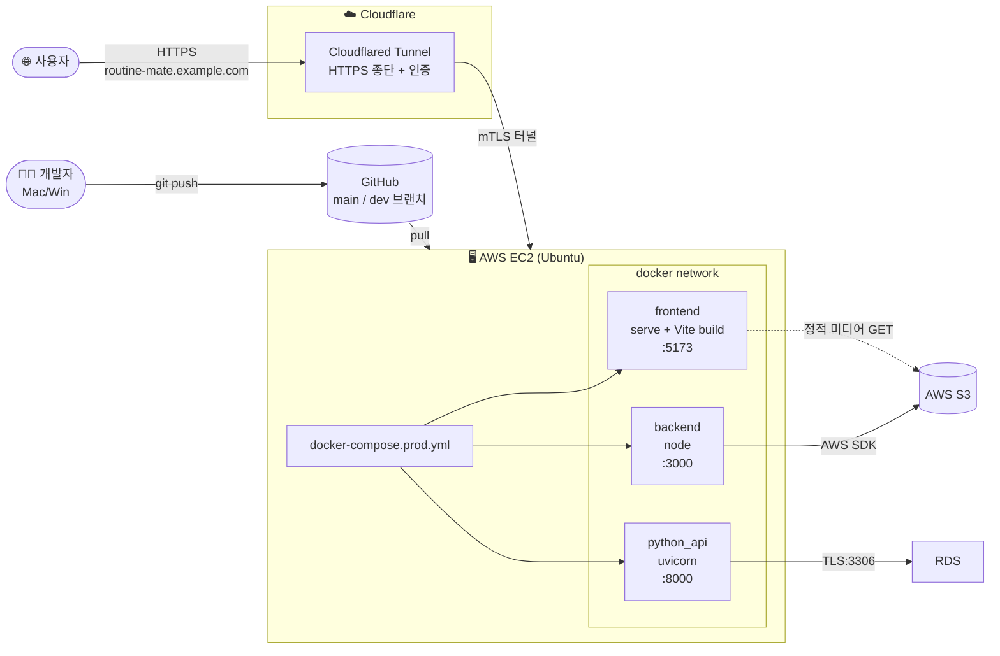
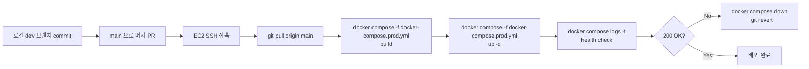

# 07. 배포 환경

## 7.1 배포 토폴로지



## 7.2 환경별 Docker Compose

| 파일 | 용도 | 차이 |
|------|------|------|
| `docker-compose.yml` | 로컬 개발 | `vite dev`, hot-reload, MySQL 컨테이너 동봉 가능 |
| `docker-compose.prod.yml` | 운영 | `vite build` 결과를 `serve` 로 정적 서빙, 외부 RDS 사용, 환경 변수는 각 서비스 `.env` 주입 |

운영 컴포즈 핵심 (요약):

```yaml
services:
  frontend:
    build: { dockerfile: Dockerfile.frontend.prod }
    ports: ["5173:5173"]
    restart: unless-stopped

  backend:
    build: { dockerfile: Dockerfile.backend.prod }
    ports: ["3000:3000"]
    env_file: [./src/backend/.env]   # INTERNAL_API_KEY, AWS, FRONTEND_URL
    depends_on: [python_api]
    restart: unless-stopped

  python_api:
    build: { dockerfile: Dockerfile.python_api.prod }
    ports: ["8000:8000"]
    env_file: [./src/python_api/.env] # INTERNAL_API_KEY, DB_*
    restart: unless-stopped
```

## 7.3 Dockerfile 책임

| 파일 | 베이스 | 빌드 단계 | 비고 |
|------|--------|----------|------|
| `Dockerfile.frontend.prod` | `node:20-alpine` 멀티 스테이지 | `npm ci && npm run build` → `dist/` 를 `serve` 로 서빙 | 정적 자산만 노출 |
| `Dockerfile.backend.prod` | `node:20-alpine` | `npm ci --omit=dev` | Express 만 노출, FastAPI 호출은 내부 DNS (`http://python_api:8000`) |
| `Dockerfile.python_api.prod` | `python:3.12-slim` | `pip install -r requirements.txt`, `uvicorn app:app --host 0.0.0.0 --port 8000` | 외부 미노출, INTERNAL_API_KEY 만 통과 |

## 7.4 환경 변수 정리

| 변수 | 사용 위치 | 설명 |
|------|----------|------|
| `INTERNAL_API_KEY` | backend + python_api | 내부 통신 게이트 |
| `DB_HOST/DB_PORT/DB_USER/DB_PASSWORD/DB_NAME` | python_api | MySQL 접속 |
| `PYTHON_API` | backend | Express 가 호출할 FastAPI URL |
| `FRONTEND_URL` | backend | CORS 허용 origin 목록 |
| `AWS_ACCESS_KEY_ID`/`AWS_SECRET_ACCESS_KEY` | backend | multer-s3 / S3 SDK. 가능하면 EC2 IAM Role 권장. |
| `AWS_S3_BUCKET` / `AWS_REGION` | backend | 업로드 대상 |
| `NODE_ENV` | backend | 운영 쿠키 옵션(`secure`, `sameSite`) 결정 |

## 7.5 Cloudflared Tunnel 도입 이유

| 비교 항목 | EC2 직접 노출 (Elastic IP) | Cloudflared Tunnel |
|-----------|--------------------------|--------------------|
| HTTPS 인증서 | Let's Encrypt 직접 관리 | Cloudflare 가 자동 |
| EC2 IP 노출 | ✅ 그대로 노출 | ❌ 비공개, 아웃바운드만 사용 |
| DDoS 방어 | nginx + iptables 자력 | Cloudflare 가 1차 흡수 |
| 보안 그룹 | 80/443 인바운드 오픈 | 인바운드 0 (아웃바운드만) |
| 비용 | 도메인 + 인증서만 | 무료 티어 |

→ 본 프로젝트는 **EC2 인바운드 0 정책**으로 운영. 자세한 셋업은 [`../cloudflared-tunnel.md`](../cloudflared-tunnel.md) 참고.

## 7.6 배포 절차 (수동)



운영 명령은 [`start-docker.sh`](../../start-docker.sh), [`start.sh`](../../start.sh), [`server.sh`](../../server.sh) 에 정리.

## 7.7 무중단 / 롤백 정책

- 현재는 **컨테이너 단위 재배포** (수십 초 다운타임 허용).
- 롤백 = `git revert` + `docker compose build && up -d`.
- DB 마이그레이션은 **idempotent + 순방향만** → 롤백 시 데이터 손실 없음.

## 7.8 모니터링 / 로깅

- 컨테이너 stdout → `docker compose logs` 로 통합 확인.
- FastAPI 에러는 `print("🔴 오류:", e)` 로 stderr 출력 → 식별이 쉬움.
- 운영 강화 백로그: CloudWatch Logs 연동, Grafana / Prometheus, 알람 (5xx 비율).

## 7.9 백업

| 자원 | 백업 방식 |
|------|----------|
| RDS MySQL | AWS RDS 자동 백업 (일 단위 스냅샷) |
| S3 객체 | 버킷 버전 관리(Versioning) — 실수 DELETE 복구 가능 |
| 코드 | GitHub `main` + `dev` 브랜치 |

---

이전: [06. 보안 정책](./06-security.md) · 다음: [08. 본인 기여](./08-contribution.md)
