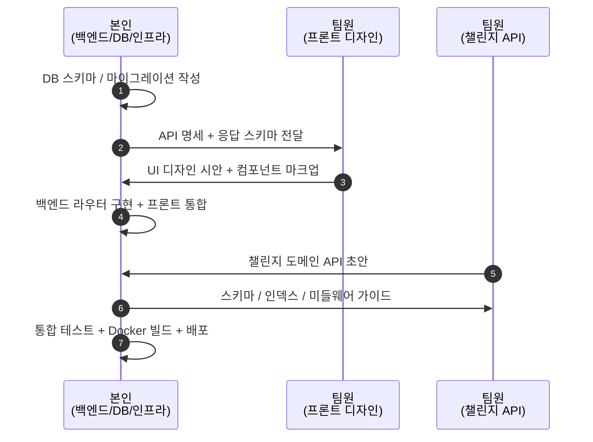

# 08. 본인 기여 명시

> 본 챕터는 보고서 평가용으로, 팀 내 역할 분담과 본인이 직접 작성·운영한 범위를 명시한다.

## 8.1 한 줄 요약

> **본인은 챌린지 도메인을 제외한 모든 백엔드(Express BFF + FastAPI) + DB 스키마 / 마이그레이션 / 인프라(Docker · AWS · 배포) + 프론트–백 통합을 단독 담당했다. 챌린지 도메인 일부와 프론트 UI/UX 디자인은 팀원 담당.**

## 8.2 기여 영역 매트릭스

```mermaid
flowchart TB
    subgraph Mine["✅ 본인 기여"]
      direction TB
      A1[전체 아키텍처 설계<br/>3-Tier · BFF 패턴 채택]
      A2[DB 스키마 + 마이그레이션 전체]
      A3[Express BFF 전 라우터<br/>(챌린지 제외)]
      A4[FastAPI 전 라우터<br/>(챌린지 제외)]
      A5[S3 · 세션 · 미들웨어 · 풀]
      A6[Docker / AWS / Cloudflared 배포]
      A7[프론트–백 통합 + 디버깅]
    end

    subgraph Team["👥 팀원 기여"]
      B1[챌린지 도메인<br/>challenge.js / challenge.py<br/>ChallengePage.jsx 일부]
      B2[프론트 UI/UX 디자인]
    end

    Mine --- Team
```

## 8.3 영역별 상세 내역

### 8.3.1 시스템 설계 / 아키텍처

| 산출물 | 내용 |
|--------|------|
| 3-Tier 도입 결정 | React → Express BFF → FastAPI 분리 |
| 신뢰 경계 정의 | 세션은 Express, 내부 키는 FastAPI 이중 검증 |
| 통신 규약 | `credentials: include`, `X-Internal-Api-Key`, JSON 단일 응답 등 |
| 단일 출처(SSOT) | `src/frontend/config.js` 의 `API_BASE` 한 곳 |

### 8.3.2 DB 설계 / 마이그레이션 (100% 본인)

| 파일 | 책임 |
|------|------|
| `docs/performance-indexes-2026-05-10.sql` | 조회 인덱스 설계 |
| `docs/migrations-2026-05-13-admin-challenge.sql` | 챌린지·공지·신고 테이블 신설 |
| `docs/migrations-2026-05-17-feeds-soft-delete.sql` | 피드 Soft Delete 도입 |
| `docs/migrations-2026-05-20-challenge-feed-share.sql` | 챌린지 → 피드 자동 공유 |
| `docs/migrations-2026-05-20-users-bio.sql` | bio 컬럼 추가 |
| UUID v7 + Soft Delete 정책 정립 | 모든 테이블에 일관 적용 |

> 챌린지 도메인 테이블도 본인이 직접 설계·작성. 챌린지 *API 라우터* 는 팀원이 작성.

### 8.3.3 Express BFF (`src/backend/`)

| 파일 | 담당 |
|------|------|
| `app.js` (미들웨어, 세션, 라우터 마운트) | ✅ 본인 |
| `database.js` | ✅ 본인 |
| `lib/s3.js` (S3 SDK + 키 검증 유틸) | ✅ 본인 (2026-05-23 신규) |
| `middleware/requireAuth.js`, `requireAdmin.js` | ✅ 본인 |
| `routes/login.js` (인증·프로필·아바타) | ✅ 본인 |
| `routes/routine.js`, `completion.js` | ✅ 본인 |
| `routes/feed.js`, `comment.js`, `like.js` | ✅ 본인 |
| `routes/mypage.js`, `stats.js` | ✅ 본인 |
| `routes/notice.js`, `report.js` | ✅ 본인 |
| `routes/challenge.js` | 👥 팀원 (스키마는 본인) |

### 8.3.4 FastAPI (`src/python_api/`)

| 파일 | 담당 |
|------|------|
| `app.py` (전역 INTERNAL_API_KEY 미들웨어, 라우터 마운트) | ✅ 본인 |
| `database.py` (PyMySQL 풀) | ✅ 본인 |
| `routers/user.py` | ✅ 본인 |
| `routers/routine.py`, `completion.py` | ✅ 본인 |
| `routers/feed.py`, `comment.py`, `like.py` | ✅ 본인 |
| `routers/mypage.py`, `stats.py` | ✅ 본인 |
| `routers/notice.py`, `report.py` | ✅ 본인 |
| `routers/challenge.py` | 👥 팀원 |

### 8.3.5 인프라 / 배포 (100% 본인)

- `docker-compose.yml`, `docker-compose.prod.yml`
- `Dockerfile.frontend(.prod)`, `Dockerfile.backend(.prod)`, `Dockerfile.python_api(.prod)`
- AWS EC2 셋업, AWS RDS MySQL 8 인스턴스 구성
- AWS S3 버킷 (feed/ · profile/ 프리픽스 분리, 정적 호스팅 정책)
- Cloudflared Tunnel 설정 (`docs/cloudflared-tunnel.md`)
- 운영 스크립트 `start-docker.sh`, `start.sh`, `server.sh`

### 8.3.6 프론트엔드 통합

> UI/UX 디자인은 팀원이 담당했지만, **백엔드와의 API 통합, 상태 관리, 에러 처리, 무한 스크롤, 파일 업로드, 세션 처리는 본인이 모두 작업**했다.

| 화면 | 담당 영역 |
|------|----------|
| `LoginPage.jsx`, `SignupPage.jsx` | 백엔드 통신·검증 본인 / 디자인 팀원 |
| `RoutinePage.jsx` | 백엔드 통신·완료 토글 본인 / 디자인 팀원 |
| `FeedPage.jsx` | 무한 스크롤 + 멀티 파일 업로드 + 신고 본인 / 디자인 팀원 |
| `MyPage.jsx` | 통합 조회 + 아바타 업로드 + Blob URL 관리 본인 / 디자인 팀원 |
| `StatsPage.jsx` | 백엔드 통신 본인 / 차트 디자인 팀원 |
| `ChallengePage.jsx` | 챌린지 호출 부분 팀원 / 다른 화면과 공통 컴포넌트는 본인 |
| `AdminPage.jsx` | 관리자 인증 / 공지 / 신고 처리 본인 / 챌린지 등록 팀원 |
| `NoticeList.jsx`, `NoticeDetail.jsx` | 본인 |

### 8.3.7 운영 / 품질

| 항목 | 본인 기여 |
|------|----------|
| 코드 리뷰 (`docs/code-review-current-state-2026-05-20.md`) | 본인 단독 작성 |
| 백로그 관리 (README #1~#19) | 본인 |
| Soft Delete 누락 P0 패치 (`mypage.py:_load_gallery`) | 본인 (2026-05-23) |
| 4-요소 수정 자국 주석 규칙 정립 | 본인 |

## 8.4 협업 흐름 (요약)



## 8.5 본인 역량 정리

이 프로젝트에서 본인이 직접 다룬 기술/도메인 키워드:

- **백엔드 설계**: BFF 패턴, 미들웨어 체이닝, 신뢰 경계 분리
- **데이터베이스**: MySQL 8, 인덱스 설계, UUID v7, Soft Delete, 트랜잭션
- **클라우드**: AWS EC2 / RDS / S3 / IAM, Cloudflared Tunnel
- **DevOps**: Docker, docker-compose, 멀티 스테이지 빌드
- **보안**: bcrypt, httpOnly 세션, INTERNAL_API_KEY, S3 키 검증
- **풀-스택 통합**: React 상태 관리 ↔ Express BFF ↔ FastAPI ↔ MySQL
- **운영 품질**: 백로그 관리, 코드 리뷰, 4-요소 주석 규칙, P0 분류

---

이전: [07. 배포 환경](./07-deployment.md) · 다음: [09. 한계 및 개선 방향](./09-limitations-improvements.md)
